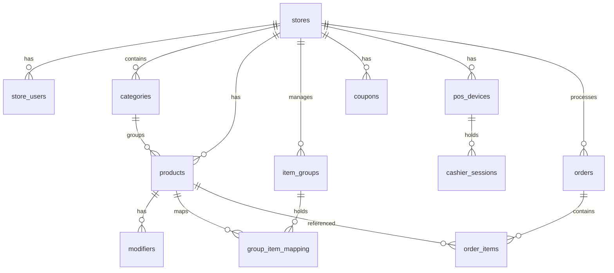

# Cashpilot POS - Comprehensive System Architecture & Code Structure Documentation

This document provides a complete, updated breakdown of the current architecture, tech stack, database schema, file layouts, and detailed code implementations of the **Cashpilot POS (Point of Sale)** system.

---

## 1. System Architecture & Tech Stack

### Frontend
- **Core Identity:** Pure Web App (PWA) designed for SaaS scalability. No Native mobile code. No .exe desktop apps.
- **Framework:** React.js initialized via Vite.
- **Styling:** Tailwind CSS with dynamic themes (Light/Dark Mode toggle) and RTL (Arabic-first) UI/UX direction support.
- **Icons:** `lucide-react` for modern, scalable iconography.
- **HTTP Client:** Native `fetch` API and `@supabase/supabase-js` client SDK for direct queries and real-time database subscriptions.
- **Build Mode & Hostname Routing:** Detects whether the app runs in backoffice central SaaS mode (`cashmint.online`, its subdomains, or `VITE_APP_MODE=master`) or standard POS terminal mode. Implements lazy loading (`React.lazy` and `Suspense`) for dashboards to support code-splitting and optimize bundle sizes. Each hosted site must receive its matching mode-specific build output; build directories are not interchangeable.
- **Session Lifecycle & Stale Data Cleanup:** Clears all cached user data and terminal sessions from `localStorage` if a login switch is detected. Employs automatic 401/expired JWT token handling to log out and refresh the app.


### Backend & Database
- **Database:** Supabase (PostgreSQL instance).
- **Security:** Tenant-scoped RLS policies and RPC endpoints are defined in version-controlled migrations. The deployed Supabase project's RLS state must be verified after every migration; do not assume a local SQL file has been applied to production.
- **Database Migrations:** SQL migration files located in `supabase/migrations/` manage schema changes version-by-version.
- **Serverless Functions:** Supabase Edge Functions (Deno runtime) for API webhooks, AI business analytics, user administration, and menu extraction.

### Third-Party Integrations
1. **Stripe Connect (Standard accounts):**
   - Store administrators start OAuth from the backoffice. Supabase Edge Functions create a single-use state token, redirect to Stripe, exchange the authorization code server-side, and store only the connected Stripe account ID and non-sensitive connection metadata.
   - The frontend never stores or displays Stripe credentials. When server configuration is absent, Connect returns `STRIPE_CONNECT_NOT_CONFIGURED` and the UI stays disabled with a support message.
   - Terminal reader registration and payment processing are intentionally outside the Connect architecture.
   - **Temporary rollback:** the Store Backoffice currently uses the legacy manual Stripe form for testing. It stores `stripe_api_key`, `stripe_webhook_secret`, and `stripe_terminal_id` in browser `localStorage` on that device. This is not secure and must not be treated as the production configuration. The Stripe Connect migrations and Edge Functions remain in the repository but are not active in the frontend until the secure flow is restored.
2. **Payments Deep Linking (Viva Wallet & SumUp):**
   - Supports deep linking to external payment provider apps (Viva Wallet/SumUp) using native device URI schemes.
3. **Cloud Order Webhook:** HubRise API order webhooks.
4. **Local Hardware Printing (Epson TM-T20IV & TM-M30):**
   - Sends ePOS-Print XML commands over SOAP POST requests to the local printer IP using a secure HTTPS endpoint (`https://{IP}/cgi-bin/epos/service.cgi`).
   - Generates cash drawer triggers using the ESC/POS pulse tag `<pulse drawer="drawer_1" time="pulse_100"/>` as well as the fallback `<drawer pulse="1"/>` command.
   - **Silent Iframe Fallback:** Handles browser CORS/mixed-content blocks by automatically falling back to rendering receipts on a hidden 72mm iframe using browser print mechanics (`window.print()`).
5. **AI Assistants:** Dahl API inference engine using the `moonshotai/Kimi-K2.6` model.
   - **AI Menu OCR Assistant:** Scans menus (Image/PDF) to generate structured categories, item groups, and products.
   - **AI Business Analyst:** Interactive cashier sidebar widget analyzing sales trends, products, and operational configurations. Supports cashier permissions (`ai_enabled` toggle) and Super Admin global bypass mode.
6. **Promo Code / Coupon System:**
   - Evaluates active coupons in real-time. Cashiers enter promo codes to calculate percentage or fixed discounts directly on the checkout screen.
7. **POS Device Authentication & Health Monitoring:**
   - Registers terminals using unique shortcodes, querying the `pos_devices` table.
   - Subscribes to real-time `DELETE` or `UPDATE` events on the active terminal row, immediately executing a clean local logout and shift closure if the device is revoked or deactivated.
   - Runs a backup background polling health check every 20 seconds to confirm the device is still active.


---

## 2. Database Schema

The database is built on PostgreSQL inside Supabase. Table structures are defined by migrations in `supabase/migrations/`. Below is the entity relationship diagram representing the primary tables:



### Table Definitions:
1. **`stores`**: Represents store tenants. Contains attributes like `id` (UUID), `name` (TEXT), `business_type` (TEXT), integration and branding fields, `timezone` (TEXT, default `Europe/Brussels`), `currency` (TEXT, default `EUR`), `theme_config` (JSONB), `onboarding_status` (TEXT), `onboarding_completed` (BOOLEAN), `onboarding_completed_at` (TIMESTAMPTZ), and `created_at` (TIMESTAMPTZ).
2. **`store_users`**: Maps users to stores. Contains `id` (UUID), `user_id` (UUID), `store_id` (UUID, foreign key references `stores`), `role` (`admin` or `cashier`), `ai_enabled` (BOOLEAN, defaults to `false`), and `created_at` (TIMESTAMPTZ).
3. **`categories`**: Menu groups (e.g., Tacos, Side, Family Meals, Beef Burgers). Contains `id` (UUID), `name` (TEXT), `store_id` (UUID, foreign key references `stores`), and `created_at` (TIMESTAMPTZ).
4. **`products`**: Standalone sales items. Contains `id` (UUID), `category_id` (UUID), `accounting_group_id` (UUID), `name` (TEXT), `price` (NUMERIC), and `store_id` (UUID). The legacy `vat_rate` column is deprecated and retained only for backward compatibility; new products use Accounting Groups and Tax Profiles.
5. **`modifiers`**: Product add-ons. Contains `id` (UUID), `product_id` (UUID, foreign key references `products`), `name` (TEXT), and `price_adjustment` (NUMERIC, defaults to `0.00`).
6. **`orders`**: Checkout receipts. Contains `id` (UUID), `store_id` (UUID, foreign key references `stores`), `status` (`new` for cloud orders, `pending` for unpaid card orders, `completed`, `cancelled`), `total_amount` (NUMERIC), `raw_payload` (JSONB description of items, order type, applied coupon details, timestamp), and `created_at` (TIMESTAMPTZ).
7. **`order_items`**: Junction mapping for orders. Contains `id` (UUID), `order_id` (UUID, foreign key references `orders`), `product_id` (UUID, foreign key references `products`), `quantity` (INTEGER), `price` (NUMERIC, defaults to `0.00`), `subtotal` (NUMERIC), and `store_id` (UUID, foreign key references `stores`).
8. **`item_groups`**: Option groups for products (e.g. burger extras, side choices). Contains `id` (UUID), `name` (TEXT), `sku` (TEXT), `is_required` (BOOLEAN), `min_items` (INTEGER), `max_items` (INTEGER), `price_strategy` (`keep_initial` or `set_price`), `group_price` (NUMERIC), `store_id` (UUID, foreign key references `stores`), and `created_at` (TIMESTAMPTZ).
9. **`group_item_mapping`**: Maps catalog products into option groups. Contains `id` (UUID), `group_id` (UUID, foreign key references `item_groups`), `product_id` (UUID, foreign key references `products`), `override_price` (NUMERIC), `store_id` (UUID, foreign key references `stores`), and `created_at` (TIMESTAMPTZ).
10. **`coupons`**: Discount promo codes. Contains `id` (UUID), `store_id` (UUID, foreign key references `stores`), `code` (TEXT), `discount_type` (`percentage` or `fixed`), `discount_value` (NUMERIC), `is_active` (BOOLEAN, default true), and `created_at` (TIMESTAMPTZ). Unique per store code.
11. **`pos_devices`**: Represents registered POS hardware terminal devices mapped to stores. Contains `id` (UUID), `store_id` (UUID, foreign key references `stores`), `device_name` (TEXT), `activation_code` (TEXT, unique), `status` (TEXT, 'active' or 'revoked'), `last_active_at` (TIMESTAMPTZ), and `created_at` (TIMESTAMPTZ).
12. **`cashier_sessions`**: Tracks open cashier shifts and sessions per POS device. Contains `id` (UUID), `device_id` (UUID, foreign key references `pos_devices`), `cashier_name` (TEXT), `status` (TEXT, 'open' or 'closed'), `opened_at` (TIMESTAMPTZ), `closed_at` (TIMESTAMPTZ), `opening_balance` (NUMERIC), `total_sales` (NUMERIC, default 0.00), `cash_balance` (NUMERIC, default 0.00), `metadata` (JSONB, default `{}`), and `created_at` (TIMESTAMPTZ).
13. **`system_settings`**: Global platform configurations. Contains `id` (INTEGER, primary key), `maintenance_mode` (BOOLEAN, defaults to `false`), and `auto_backup` (BOOLEAN, defaults to `true`).
14. **`store_receipt_counters`**: Holds the next sequential receipt number for each store.
15. **`payments`**: Payment records linked to orders, including method, status, amount, provider reference, processor fee, net settlement, and payment time.
16. **`refunds`**: Refund audit records linked to the original order and, when applicable, its order line, with net/VAT/gross amounts and the reason.
17. **`daily_closings`**: Immutable per-store daily-closing snapshots with receipt range, sales totals, VAT and payment breakdowns, and locking state.
18. **`stripe_connect_connections`**: One connected Stripe Standard account per store, storing the account ID, scope, mode, and connection lifecycle metadata—never Stripe credentials or OAuth tokens.
19. **`stripe_connect_states`**: Short-lived, single-use server-side OAuth state records binding a Connect callback to the initiating user and store.
20. **`tax_rates`, `tax_profiles`, and `accounting_groups`**: Tenant-scoped, RLS-protected tax configuration. Products select an accounting group, whose profile resolves a configured tax rate per `dine_in`, `takeaway`, `delivery`, or fallback order type.

The accounting migration also adds immutable receipt, payment, cashier/device, currency, discount, and tax-snapshot fields to `orders` and `order_items`. These fields make reports independent of later catalog edits.

### Trusted checkout accounting

`create_accounting_order` is the only checkout write path for the POS. It ignores client-supplied line prices, VAT amounts, order totals, and discount amounts. For every submitted product it loads the current store-owned product and modifiers, resolves the tax rate from its Accounting Group and Tax Profile using the order type, derives any active coupon from the server-side coupon record, and writes immutable accounting/tax snapshots to the receipt. A sale is rejected with `TAX_CONFIGURATION_MISSING` when a product has no valid group/profile/rate, rather than silently falling back to a fixed VAT percentage.

### 2.1 Database Migrations

The database structure evolves incrementally through version-controlled SQL files located in `supabase/migrations/`:

1. **`20260708000000_init_core_schema.sql`**: Initializes the baseline relational structure for the multi-tenant SaaS application, setting up `stores`, `store_users`, `categories`, `products`, `modifiers`, `orders`, `order_items`, `item_groups`, and `group_item_mapping` tables.
2. **`20260715000000_fix_stores_rls.sql`**: Hardens Row Level Security (RLS) policies for stores, products, categories, modifiers, and option mappings to strictly enforce tenant separation.
3. **`20260715010000_create_coupons_table.sql`**: Creates the `coupons` table and implements RLS rules, allowing authenticated cashiers to select active coupons and store admins to manage them.
4. **`20260715940000_fix_storage_policies.sql`**: Secures `storage.objects` policies for the `logos` bucket, restricting uploads to authenticated users and management (update/delete) to authorized store administrators.
5. **`20260715950000_add_status_enums.sql`**: Introduces custom PostgreSQL status enums (`cashier_session_status` and `pos_device_status`) and converts columns in `cashier_sessions` and `pos_devices` to use these types.
6. **`20260715960000_add_missing_indexes.sql`**: Generates performance indexes on foreign key mappings and search parameters (`idx_products_store_id`, `idx_orders_created_at`, etc.) for query optimization.
7. **`20260715970000_add_auth_users_fk.sql`**: Links `public.store_users.user_id` to Supabase auth accounts (`auth.users`) using a foreign key constraint with cascade deletions.
8. **`20260715970500_secure_cashier_sessions.sql`**: Implements fine-grained security policies on cashier sessions, permitting shift activation via device verification and restricts write control to tenant members.
9. **`20260715971000_secure_pos_devices_activation.sql`**: Hardens terminal registration security, introducing the secure RPC function `verify_pos_device_activation` and defining strict read/write policies for POS devices.
10. **`20260715972000_secure_stores_policies.sql`**: Implements tenant validation for store information, allowing new users without stores to create a store row, and giving complete CRUD overrides to superadmins.
11. **`20260715975000_fix_store_users_recursion.sql`**: Eliminates circular dependency recursion errors in RLS checks for `store_users` by using a security definer helper function `check_user_is_store_admin`.
12. **`20260715980000_enable_rls_on_all_tables.sql`**: Explicitly enables Row Level Security across all public relational tables in the PostgreSQL database.
13. **`20260715990000_add_superadmin_function.sql`**: Establishes `is_superadmin()` security checking functions to identify administrative users based on their role in mapping tables or specific email domains.
14. **`20260716000000_create_pos_devices_and_sessions.sql`**: Creates tables `pos_devices` and `cashier_sessions` to facilitate hardware locking and shift accounting (since secured by subsequent migrations).
15. **`20260716000100_create_system_settings.sql`**: Creates the `system_settings` table to track global configurations like maintenance blocks, limiting management controls to superadmins.
16. **`20260716010000_add_metadata_to_cashier_sessions.sql`**: Adds a JSONB `metadata` column to cashier sessions for tracking dynamic shift information.
17. **`20260716010000_add_user_helper_functions.sql`**: Introduces secure resolver utilities (`get_user_email` and `resolve_user_email`) and adds `store_users` to the real-time replication publication.
18. **`20260716020000_add_ai_enabled_column.sql`**: Adds an `ai_enabled` permission boolean to `store_users` to control cashier sidebar access to the business assistant.
19. **`20260716020000_add_sales_columns_to_cashier_sessions.sql`**: Extends the shift ledger system by adding `total_sales` and `cash_balance` columns to the `cashier_sessions` schema.
20. **`20260717000000_store_deletion_cleanup.sql`**: Registers the `handle_store_deletion_cleanup()` trigger to clean up auth accounts in `auth.users` when a tenant store is deleted (ensuring users are not mapped elsewhere).
21. **`20260717010000_add_orders_rls_policies.sql`**: Restricts the `orders` and `order_items` queries, allowing only store members and global platform superadmins to select or insert transactions.
22. **`20260717233429_accounting_exports.sql`**: Adds accounting snapshots, sequential receipts, payment/refund and daily-closing tables, tenant-scoped reporting views, and transactional checkout/settlement RPCs.
23. **`20260718000000_secure_pos_catalog_rpc.sql`**: Adds POS-device RPC endpoints for activation verification, heartbeat updates, and catalog loading (`verify_pos_device_activation`, `touch_pos_device`, and `get_pos_catalog`) plus tenant-scoped catalog policies. These are additive changes and do not modify existing rows.
24. **`20260718001904_store_level_onboarding.sql`**: Adds persisted store onboarding and theme fields, membership-scoped store/logo policies, and the `save_store_onboarding` RPC.
25. **`20260718002255_enable_store_membership_rls.sql`**: Ensures RLS is enabled for the stores and membership tables used by onboarding.
26. **`20260718002340_secure_onboarding_rpc_grants.sql`**: Revokes anonymous access to the onboarding RPC and grants it only to authenticated users.
27. **`20260718002523_tighten_logo_listing.sql`**: Removes broad logo-object listing access from the public bucket.
28. **`20260718003815_fix_logo_storage_upsert_policy.sql`**: Adds the scoped Storage SELECT policy required for authenticated logo replacement via upsert.
29. **`20260718010000_stripe_connect_architecture.sql`**: Adds Stripe Connect account/state tables, tenant-safe read access, and blocks all browser writes to the OAuth state and connection records.
30. **`20260718020000_accounting_groups_tax_profiles.sql`**: Adds editable tax rates/profiles/accounting groups, Belgium-oriented review templates, cross-store integrity checks, and non-destructive legacy product assignment. It does not alter historical order snapshots.

---

## 3. Directory File Structure

The project has the following file structure:

```
cashpilot/
├── .env                              # Production Supabase credentials & configurations
├── .env.master                       # Configures VITE_APP_MODE=master (Superadmin central mode)
├── .env.pos                          # Configures VITE_APP_MODE=pos (POS Terminal mode)
├── index.html                        # Main HTML template wrapper
├── package.json                      # Node packages configurations
├── vite.config.js                    # Vite bundler rules
├── seed.sql                          # Database menu data seed script
├── gemini.md                         # POS System Architecture Rules
├── app_structure_documentation.md    # Active architectural documentation
├── supabase/
│   ├── migrations/                   # SQL Schema and RLS Policies Migrations
│   │   ├── 20260708000000_init_core_schema.sql
│   │   ├── 20260715000000_fix_stores_rls.sql
│   │   ├── 20260715010000_create_coupons_table.sql
│   │   ├── 20260715940000_fix_storage_policies.sql
│   │   ├── 20260715950000_add_status_enums.sql
│   │   ├── 20260715960000_add_missing_indexes.sql
│   │   ├── 20260715970000_add_auth_users_fk.sql
│   │   ├── 20260715970500_secure_cashier_sessions.sql
│   │   ├── 20260715971000_secure_pos_devices_activation.sql
│   │   ├── 20260715972000_secure_stores_policies.sql
│   │   ├── 20260715975000_fix_store_users_recursion.sql
│   │   ├── 20260715980000_enable_rls_on_all_tables.sql
│   │   ├── 20260715990000_add_superadmin_function.sql
│   │   ├── 20260716000000_create_pos_devices_and_sessions.sql
│   │   ├── 20260716000100_create_system_settings.sql
│   │   ├── 20260716010000_add_metadata_to_cashier_sessions.sql
│   │   ├── 20260716010000_add_user_helper_functions.sql
│   │   ├── 20260716020000_add_ai_enabled_column.sql
│   │   ├── 20260716020000_add_sales_columns_to_cashier_sessions.sql
│   │   ├── 20260717000000_store_deletion_cleanup.sql
│   │   ├── 20260717010000_add_orders_rls_policies.sql
│   │   ├── 20260717233429_accounting_exports.sql
│   │   ├── 20260718000000_secure_pos_catalog_rpc.sql
│   │   ├── 20260718001904_store_level_onboarding.sql
│   │   ├── 20260718002255_enable_store_membership_rls.sql
│   │   ├── 20260718002340_secure_onboarding_rpc_grants.sql
│   │   ├── 20260718002523_tighten_logo_listing.sql
│   │   ├── 20260718003815_fix_logo_storage_upsert_policy.sql
│   │   └── 20260718010000_stripe_connect_architecture.sql
│   └── functions/                    # Deno Edge Functions
│       ├── ai-business-analyst/      # Deno-Kimi Business Chatcompletion proxy endpoint
│       ├── ai-menu-assistant/        # OCR Vision extraction endpoint
│       ├── hubrise-webhook/          # External webhook receiver & order mapper
│       ├── admin-create-user/        # Secure user accounts creation endpoint
│       ├── admin-delete-user/        # Secure user accounts deletion endpoint
│       ├── stripe-connect-start/     # Authenticated Connect OAuth URL creator
│       ├── stripe-connect-callback/  # Public, state-validated OAuth callback
│       └── stripe-connect-status/    # Authenticated store connection status
├── supabase/config.toml               # Edge Function JWT configuration
└── src/
    ├── main.jsx                      # Entrypoint bootstrap script
    ├── index.css                     # Global design styles
    ├── App.css                       # Component animations & custom layout styles
    ├── supabaseClient.js             # Initialized Supabase JS SDK client
    ├── Login.jsx                     # Supabase-auth email/password user gateway
    ├── App.jsx                       # Master POS checkout interface & settings dashboard
    ├── assets/                       # Static media files and branding graphics
    │   ├── hero.png                  # Dashboard welcome background image
    │   ├── react.svg                 # React framework SVG logo
    │   └── vite.svg                  # Vite bundler SVG logo
    ├── admin/                        # Backoffice Dashboard Modules
    │   ├── AdminDashboard.jsx        # Navigation shell (Sidebar, Theme & Language toggles)
    │   ├── CatalogManagement.jsx     # Products, Categories, & Modifiers CRUD
    │   ├── IntegrationSettings.jsx   # Hardware (Printer IP) & Stripe / HubRise configuration
    │   ├── SalesHistory.jsx          # Revenue logs, Top Sellers list, & receipt reprinting
    │   └── AccountantExports.jsx     # CSV sales/VAT/payment exports and daily-closing controls
    ├── components/                   # Reusable UI components
    │   ├── OnboardingWizard.jsx      # Setup flow for new store mappings
    │   └── admin/                    # Admin components
    │       ├── AIChatWidget.jsx      # Floating AI Business Analyst widget
    │       ├── GroupConfigForm.jsx   # Group options configuration details form
    │       └── ItemsDashboard.jsx    # Advanced menu & options layout with AI OCR import
    ├── providers/
    │   └── StoreThemeProvider.jsx    # Applies persisted store branding as CSS variables
    ├── superadmin/                   # Master/Super Admin Control Panel (cashmint.online)
    │   ├── SuperAdminDashboard.jsx   # Main layout, tab management, & mockup system controls
    │   ├── StoresManagement.jsx      # Global store tenant table & CRUD action forms
    │   └── components/               # Superadmin specific dialogs and drawers
    │       ├── CatalogManagerDrawer.jsx # Slide-over catalog manager for super admin
    │       └── UserManagerDrawer.jsx    # Slide-over user manager drawer with real-time websocket sync
    └── utils/
        ├── accountingExports.js      # CSV formatting and browser download helper
        ├── printerService.js          # Epson ePOS XML generator, pulse (drawer kick), & silent iframe print
        ├── storeTheme.js              # Logo palette extraction and accessible theme generation
        ├── storeTheme.test.js         # Theme utility tests
        ├── taxCalculator.js           # Tax-inclusive order accounting and discount allocation
        └── taxCalculator.test.js      # Accounting calculation tests
```

---

## 4. Key Code Implementations & Core Logic

### A. Cashier Interface, Stripe Terminal, & Cart Calculations (`src/App.jsx`)
`App.jsx` handles checkout, Stripe BBPOS WisePad 3 modal overlays, real-time Postgres webhook listeners, language translations, chime generation, cashier shift sessions, POS device status subscriptions, and the PIN gate.

Key features include:
1. **Cart Math Fix & Inclusive Calculations:**
   - Calculates the base cost without VAT.
   - Applies the validated coupon discount (if any):
     - `discountAmount` is calculated based on `discount_type` (`percentage` or `fixed` value).
     - `totalAmount` is computed as `Math.max(0, cartSubtotal - discountAmount)`.
     - `vatAmount` (12%) is computed as: `vatAmount = totalAmount * (vatRate / (1 + vatRate))`.
     - `subtotal` (excluding VAT) is displayed as `(totalAmount - vatAmount).toFixed(2) €`.
   - The UI display guarantees mathematical consistency (`Subtotal + VAT = Total`) while maintaining database alignment.
2. **Promo Code / Coupon Application:**
   - `handleApplyCoupon` queries the `coupons` table in Supabase matching `store_id`, `code`, and checking `is_active = true`.
   - Successfully validated coupons apply a live discount, which is logged into the order's `raw_payload` under `coupon_code` and `discount_amount` during checkout.
3. **Stripe terminal workflow (WisePad 3):**
   - Selecting Card Payment creates the database order record with status `pending`.
   - Displays `showStripeModal` spinner instructing the cashier to use the BBPOS WisePad 3 device.
   - Contains a development simulation button that calls `supabase.from('orders').update({ status: 'completed' })` to trigger mock webhooks.
4. **Real-time Order Subscriptions:**
   - Listens to PostgreSQL `UPDATE` changes. If the update payload status changes to `completed` and maps to `activePaymentOrderId`, it plays success chimes, prints the receipt, clears the cart, and closes the modal.
5. **Numeric Keyboard Access (PIN Gate):**
   - Guards access to backoffice panels with progressive lockout stages (3, 5, and 10 minutes) and OTP email bypass recovery keys.
6. **Sound Alerts:** Uses Web Audio API oscillator nodes for cashier operations:
   - Selection beep frequency: `800Hz` for `0.08` seconds.
   - Completion success chime: `523.25Hz` (0.12s) followed by `659.25Hz` (0.20s).
7. **POS Device Status, Remote Revocation & Fallback Checking:**
   - On startup, registers real-time subscription to the `pos_devices` table for updates on the logged-in `deviceId`.
   - Listens to all Postgres events (`*`) on the device row. If the device is deleted or status becomes inactive, it triggers `handleRemoteRevokeLogout` to close any open shifts, wipe caching storage, and return to the activation gateway.
   - Implements a safety background task executing every 20 seconds to fetch the device status directly from the DB. If deactivated, it forces a remote logout.
8. **Cashier Shifts & Shift Tracking:**
   - Before cashier operations can begin, a cashier session must be opened by logging the cashier name and opening cash balance. This inserts an 'open' session record into the `cashier_sessions` table.
   - Logging out updates the session to `status = 'closed'` with a `closed_at` timestamp.
   - Modified shift closure (`handleHandoverSubmit`) to directly commit the system's ledger cash balance (`cash_balance`) to the metadata closing records rather than prompting for a manual actual cash amount.
9. **User Switch Cleanup & JWT Expiry Handling:**
   - Restores session data and verifies tenant association using `resolveTenant`.
   - Wipes all cached store keys, device authorizations, and cashier configurations from `localStorage` if a session switch is detected (the authenticated user ID changes).
   - Gracefully intercepts expired JWT claims (401 errors) to log out the user and refresh the application automatically.
10. **Hostname Routing & Backoffice Central Gateway:**
    - Detects if running on `cashmint.online` or custom domains. If active, Central SaaS backoffice bypasses device checks and initiates the tree-shaken `SuperAdminDashboard` components.
    - Backoffice login enforces superadmin restriction checks via the `is_superadmin` RPC function, email domain validation (`@cashmint.online`), or role mappings, rendering cyan-blue glows and animated security accents.

---

### B. Epson ePOS Print Service & Iframe Fallback (`src/utils/printerService.js`)
Builds SOAP XML envelopes for thermal printers:
1. **Approved Model:** Optimized for `Epson TM-T20IV` & `Epson TM-M30` column alignment and parameters.
2. **Drawer Trigger:** Sends `<pulse drawer="drawer_1" time="pulse_100"/>` and `<drawer pulse="1"/>` to kick open the cash drawer.
3. **Iframe Fallback (CORS/HTTP Bypass):**
   - If direct fetch to the local printer IP fails (due to CORS blockages or mixed-content SSL limits), it triggers `printViaIframeFallback`.
   - Generates a hidden `<iframe>` loaded with a styled 72mm receipt layout and calls the browser's native print engine.

```javascript
export async function printReceipt(order, printerIP, storeName = 'Cashmint', options = {}) {
  const cleanIP = printerIP ? printerIP.trim() : '';

  if (!cleanIP) {
    if (options.skipFallback) {
      return {
        success: false,
        transport: "epos",
        endpoint: "",
        error: options.isArabic !== false ? "عنوان IP للطابعة غير مهيأ" : "Printer IP not configured"
      };
    }
    console.warn("No printer IP configured. Triggering fallback browser printing.");
    try {
      const res = await printViaIframeFallback(order, storeName);
      return res;
    } catch (err) {
      return { success: false, transport: "iframe", endpoint: "", error: err.message };
    }
  }

  // Final ePOS-Print HTTPS URL
  const endpoint = `https://${cleanIP}/cgi-bin/epos/service.cgi?devid=local_printer&timeout=10000`;
  
  let xmlContent = '';
  if (options.minimalTest) {
    xmlContent = `<text align="center">CASHMINT TEST&#10;</text>
<text>Printer connection is working.&#10;</text>
<feed line="3"/>
<cut type="feed"/>`;
  } else {
    xmlContent = buildReceiptXML(order, storeName);
  }

  // Wrap in a SOAP Envelope
  const soapPayload = `<?xml version="1.0" encoding="utf-8"?>
<s:Envelope xmlns:s="http://schemas.xmlsoap.org/soap/envelope/">
  <s:Body>
    <epos-print xmlns="http://www.epson-pos.com/schemas/2011/03/epos-print">
      ${xmlContent}
    </epos-print>
  </s:Body>
</s:Envelope>`;

  const isDebug = import.meta.env.DEV === true || localStorage.getItem('epos_debug') === 'true';
  let response;
  let responseText = '';

  try {
    response = await fetch(endpoint, {
      method: 'POST',
      headers: {
        'Content-Type': 'text/xml; charset=utf-8',
        'SOAPAction': '""'
      },
      body: soapPayload
    });

    responseText = await response.text();

    if (!response.ok) {
      throw new Error(`HTTP ${response.status}: ${response.statusText}`);
    }

    const parser = new DOMParser();
    const xmlDoc = parser.parseFromString(responseText, "text/xml");

    // Check for SOAP Fault/detail tags first
    const faultTag = xmlDoc.getElementsByTagName('Fault')[0] || xmlDoc.getElementsByTagName('detail')[0];
    if (faultTag) {
      const faultString = xmlDoc.getElementsByTagName('faultstring')[0]?.textContent || "SOAP Fault";
      throw new Error(faultString);
    }

    const responseTag = xmlDoc.getElementsByTagName('response')[0];
    if (!responseTag) {
      throw new Error("Invalid XML response format received from printer");
    }

    const successAttr = responseTag.getAttribute('success');
    const codeAttr = responseTag.getAttribute('code');

    if (successAttr === 'true' || successAttr === '1') {
      return {
        success: true,
        transport: "epos",
        endpoint: endpoint,
        status: response.status,
        response: responseText,
        code: codeAttr || undefined
      };
    } else {
      const errorMsg = getFriendlyEpsonError(codeAttr, options.isArabic !== false);
      const err = new Error(errorMsg);
      err.code = codeAttr;
      throw err;
    }
  } catch (error) {
    if (options.skipFallback) {
      return {
        success: false,
        transport: "epos",
        endpoint: endpoint,
        status: response ? response.status : undefined,
        response: responseText || undefined,
        code: error.code || undefined,
        error: error.message
      };
    }

    console.warn("Direct ePOS-Print failed. Falling back to browser iframe printing...", error);
    try {
      const fallbackRes = await printViaIframeFallback(order, storeName);
      return fallbackRes;
    } catch (fallbackError) {
      return { 
        success: false, 
        transport: "epos",
        endpoint: endpoint,
        status: response ? response.status : undefined,
        response: responseText || undefined,
        error: `Direct connection failed (${error.message}) & Fallback print failed (${fallbackError.message})` 
      };
    }
  }
}
```

---

### C. Advanced Menu Management & AI Import (`src/components/admin/ItemsDashboard.jsx`)
Coordinates advanced option configurations and AI menu imports.
1. **AI Menu OCR (Kimi Vision):**
   - Converts the uploaded menu image/PDF file to base64.
   - Dispatches it to the `ai-menu-assistant` edge function.
   - Parses categories, option groups, and choices, and bulk inserts them into Supabase.
2. **Combined Catalog Layout:**
   - Merges regular products and item option groups into a cohesive list with status filtering.

---

### D. Group Configuration UI (`src/components/admin/GroupConfigForm.jsx`)
- Renders the details form to set option rules, selection counts (minimum and maximum values), and pricing strategy overrides.
- Unfunctional and empty placeholder sub-tabs ("POS Settings" and "Appearance") were removed to provide a clean, single-page settings view.

---

### E. Hardware, HubRise, and Stripe Connect (`src/admin/IntegrationSettings.jsx`)
- Provides input fields for the local printer IP address (optimized for `Epson TM-T20IV`).
- Removes legacy browser-held Stripe secret, webhook-secret, and reader-ID values from local storage. The page shows connection state and starts Connect through authenticated Edge Functions instead.
- Incorporates a test print button that prints a demo receipt layout and triggers cash drawer kicks.

---

### F. Sales History & Receipt Reprinting (`src/admin/SalesHistory.jsx`)
- Aggregates earnings, generates revenue trends, extracts best-selling products, and maps taxes.
- Adds a **Reprint Receipt** button inside the active order details side drawer. This formats the selected transaction details and triggers the printing pipeline.

---

### G. Edge Functions (`supabase/functions/`)
1. **`ai-menu-assistant`**: Uses Kimi Vision (`kimi-2.6` model) to parse menu images and structure the output into a unified JSON format: `{ items: [...] }`.
2. **`ai-business-analyst`**: Secure proxy that completes AI business analysis queries using `moonshotai/Kimi-K2.6` model via Dahl API endpoint completions. Dynamically switches between global platform metrics and store-level scopes based on callers RLS superadmin privileges.
3. **`hubrise-webhook`**: Processes cloud orders from HubRise API integrations, matches incoming items to store products, and logs transactions to database tables.
4. **`admin-create-user`**: Bypasses local session signs out to forcefully insert user accounts into `auth.users` with automated confirmation and map them in `public.store_users` using the service role key.
5. **`admin-delete-user`**: Deletes mapping records and permanently purges user accounts from Supabase Auth securely.

---

### H. Accountant Exports (`src/admin/AccountantExports.jsx`)
- Provides date-range CSV exports for transaction lines, VAT summaries, and payment summaries using the tenant-scoped accounting views.
- Finalizes a single-day closing through `finalize_daily_closing` and opens a print-ready A4 report that users can save as PDF.
- Reports format numbers consistently and download UTF-8-BOM, semicolon-separated CSV files suitable for common accounting tools.

---

### I. Superadmin Catalog Management Slide-over (`src/superadmin/components/CatalogManagerDrawer.jsx`)
- Provides a comprehensive, slide-over management interface designed specifically for Super/Master Admins.
- Allows direct creation, update, and deletion of categories and products for any selected store tenant directly from the master dashboard, bypassing localized store-level restricts.

---

### J. Superadmin User Management Slide-over (`src/superadmin/components/UserManagerDrawer.jsx`)
- Renders a slide-over panel for managing tenant user accounts.
- Integrates with secure Deno Edge Functions (`admin-create-user` and `admin-delete-user`) using service role keys to safely provision or permanently purge staff accounts from Supabase Auth (`auth.users`) without logging out the current admin session.
- Employs a secure PostgreSQL RPC resolver (`get_user_email`) to display registered staff email addresses.
- Listens to real-time database changes on `public.store_users` table mapped to the active store ID, updating the UI immediately.

---

### K. Floating AI Business Analyst widget (`src/components/admin/AIChatWidget.jsx`)
- Renders a floating chat bubble positioned in the bottom-left corner (`fixed bottom-6 left-6`) to prevent sidebar layout conflicts.
- Inspects user's AI access permission (`ai_enabled`) on launch and overlays a lock message ("تواصل مع الإدارة لتفعيل المساعد الذكي") if not authorized.
- Super Admins bypass authorization and query the `ai-business-analyst` Deno Edge Function with system prompt instructions configured for overall platform analytics.

---

### L. Environment Modes and Build Configuration
- The application supports three deployment modes controlled by the `VITE_APP_MODE` environment variable:
  - `pos`: POS Terminal mode. Locks down backoffice administration, bypasses wizard screens, and relies on device activation to log in cashiers.
  - `master`: Superadmin / central SaaS backoffice mode. Allows platform administrators to manage stores, view global analytics, configure settings, and bypass tenant-level restrictions.
  - `store`: Store backoffice mode, using the default environment configuration unless a `.env.store` file is added.
- Environment configurations are saved in the root as `.env`, `.env.pos`, and `.env.master`.
- Production build scripts write to separate folders so no build overwrites another:
  - `npm run build:master` creates `dist-master` for `cashmint.online`.
  - `npm run build:pos` creates `dist-pos` for `cashmint.net`.
  - `npm run build:store` creates `dist-store` for `cashmint.store`.
- Deploy the complete contents of the matching folder, including `index.html`, `assets/`, `favicon.svg`, and `icons.svg`. Remove stale assets from the host or use a deployment method that replaces the site atomically.

### M. POS RPC Contract and Deployment Recovery
- The anonymous POS login flow must call `verify_pos_device_activation(code_input)` rather than reading the `pos_devices` table directly.
- `touch_pos_device(device_uuid)` updates an active terminal heartbeat, and `get_pos_catalog(device_uuid)` returns only that active device's store, categories, products, and modifiers.
- The live Supabase project must contain these RPC endpoints before a frontend build that uses them is deployed. Missing RPCs appear in the browser as PostgREST `404` / “Could not find the function … in the schema cache” errors.
- `StoresManagement` defines `fetchStores` before its `useEffect` subscribes to it. This ordering prevents the temporal-dead-zone runtime crash (`Cannot access … before initialization`) that otherwise blanks the master dashboard.


---

### N. Accountant Exports and Immutable Sales Snapshots
- The additive `20260717233429_accounting_exports.sql` migration adds accounting snapshot fields to new orders and order lines, per-store sequential receipts, payments, refunds, and daily closing records. It does not rewrite legacy orders.
- `create_accounting_order` creates the receipt, order, immutable product/VAT snapshots, and payment atomically. It verifies that line totals reconcile with the stored header totals.
- Card payments remain pending until the provider confirms them through `complete_accounting_card_payment`; the browser must not update an order to successful payment directly. A pending card payment may be safely cancelled by its active POS device.
- `accountant_sales_transactions`, `accountant_vat_summary`, and `accountant_payments_summary` are tenant-scoped, security-invoker views. The Backoffice Accountant Exports screen produces UTF-8-BOM, semicolon-separated CSV files and a print-ready A4 daily-closing page for PDF saving.

### O. Store-Level Onboarding and Branding (`src/components/OnboardingWizard.jsx`)
- The wizard is shown only for a mapped store with `onboarding_completed = false`; it never creates a store or `store_users` mapping in the browser.
- Step 1 validates and saves the public store name through the authenticated `save_store_onboarding` RPC, then persists `onboarding_status = 'branding_required'`.
- Step 2 validates PNG/JPEG files (maximum 5 MB), extracts colors locally before upload, and completes branding only after the Storage upload succeeds. A refresh resumes from the database-backed onboarding state.
- `src/utils/storeTheme.js` uses `ImageBitmap` plus a small canvas to sample real logo pixels. Transparent pixels and low-information white/black backgrounds are ignored. The raw palette is stored separately from the generated theme.
- Regenerate cycles through valid palette-derived combinations; manual color changes immediately recalculate readable button/sidebar text. `StoreThemeProvider` writes the completed store theme to CSS variables only for store-facing backoffice pages.
- `stores` contains `theme_config`, `onboarding_status`, `onboarding_completed`, and `onboarding_completed_at`. Existing configured stores were marked complete; newly created stores start with `store_name_required`.
- The public `logos` bucket accepts only PNG/JPEG files up to 5 MB. Objects use `{store_id}/logo.{png|jpg}`. Storage RLS grants mapped store users scoped SELECT, INSERT, UPDATE, and DELETE access; SELECT is required for replacement uploads using `upsert`.
- `save_store_onboarding` checks membership inside a security-definer RPC. Anonymous execution is revoked; authenticated mapped users can update only their own store's onboarding state.

### P. Stripe Connect Configuration and Deployment
- The following Supabase Edge Function secrets are required and are the only location for Stripe configuration: `STRIPE_SECRET_KEY`, `STRIPE_CONNECT_CLIENT_ID`, `STRIPE_CONNECT_REDIRECT_URI`, `STRIPE_CONNECT_SUCCESS_URL`, and `STRIPE_CONNECT_ERROR_URL`.
- `STRIPE_CONNECT_REDIRECT_URI` must be the deployed `stripe-connect-callback` URL and must exactly match a redirect URI configured in Stripe. `STRIPE_CONNECT_SUCCESS_URL` and `STRIPE_CONNECT_ERROR_URL` must be trusted Cashmint application URLs that return the administrator to the backoffice.
- In Stripe Dashboard, enable **Connect OAuth**, copy the Connect client ID, and register the exact deployed callback URL under Connect OAuth redirect URIs. Configure the client ID and secret key from the same Stripe mode (test or live); Stripe requires the token exchange key to match the authorization-code mode.
- Deploy `stripe-connect-start`, `stripe-connect-callback`, and `stripe-connect-status` with the migration. `supabase/config.toml` marks only the callback as `verify_jwt = false`, because Stripe redirects to it without a Supabase session; it validates the state token before exchanging any code.
- No Stripe secret, webhook secret, OAuth access token, refresh token, terminal reader identifier, or payment flow is implemented or persisted by this integration. Missing configuration returns `STRIPE_CONNECT_NOT_CONFIGURED`, and the frontend displays: "Stripe integration is not configured yet. Contact Cashmint support."

### Q. Accounting Groups and VAT Profiles
- Products are assigned to an Accounting Group rather than a directly editable VAT percentage. A group maps to a Tax Profile, which selects a rate by order type. The Belgian template includes Food, Alcohol, Tax Exempt, Soft Drinks (intentionally left configurable), Legacy 12%, and an Unassigned / Legacy group for safe migration.
- Existing products are assigned to Unassigned / Legacy without changing historical orders or their VAT snapshots. Store administrators must review any legacy assignments before relying on them for new sales.
- VAT classifications and rates should be reviewed with the store accountant. Cashmint exports structured accounting and VAT records for accountant review. It is not currently a certified Belgian GKS/Blackbox system.
- Future cleanup: do not remove `products.vat_rate` until every product uses an accounting group and production migration/reporting verification is complete.

## 5. Summary of Development Milestones

1. **Authentication & Multi-Tenant Setup:** Role-based POS gateway (Admin/Cashier) with row-level security (RLS).
2. **Store-Level First-Login Onboarding:** Added a blocking, persisted two-step setup flow for assigned stores: public-name confirmation followed by logo upload and accessible palette-derived branding. Browser onboarding does not create stores or memberships.
3. **Tax-Inclusive Cart Calculations:** Corrected the POS checkout calculations to show base subtotal and tax amounts mathematically adding up to the total receipt amount.
4. **Promo Code Coupon Logic:** Implemented store-specific coupon discount applications (percentage & fixed discount value) affecting cart totals and checking out into order payloads.
5. **Stripe Terminal Integration:** Wired up the `pending` order workflow, waiting overlays, simulated webhook successful triggers, and real-time subscription update captures for card sales.
6. **Epson TM-T20IV & TM-M30 Printer Control:** Configured direct network XML SOAP envelopes over HTTPS and printer cash drawer pulse command triggers, with a hidden iframe print fallback.
7. **Admin Security Guard:** Added a numeric PIN pad verification gate with attempts limit lockout stages and OTP email codes.
8. **Sales Analytics & Reprinting:** Added revenue logs and custom reprint actions.
9. **AI Catalog Assistants:** Vision OCR menu extraction and a floating analysis chatbot.
10. **Clean Backoffice:** Removed unfinished tab screens and configuration placeholders.
11. **Superadmin Catalog Overrides:** Added slide-over controls enabling master managers to override tenant-specific categories and products.
12. **Real-time Superadmin User Management:** Integrated a slide-over drawer enabling Super Admins to create and delete tenant staff accounts from Supabase Auth (`auth.users`) and mappings via Deno Edge Functions using service role keys. Features real-time state synchronization via WebSockets.
13. **CORS Policy & Layout Alignment:** Resolved CORS policy errors by standardizing OPTIONS preflight headers in Edge Functions and realigned the AI chat widget to the bottom-left corner to avoid overlapping RTL layout navigation panels.
14. **Device Activation & Dynamic Preview:** Implemented anonymous terminal activation codes with debounced lookup in `Login.jsx` showing store names and branding logos directly in the activation gateway.
15. **Cashier Shifts & Shift Tracking:** Added cashier session tracking (`cashier_sessions`) to record shift start balances, sales, and closing ledger balance (bypassing manual actual balance requirements).
16. **Global System Maintenance & Backup Config:** Integrated database-level configurations (`system_settings`) allowing superadmins to dynamically toggled maintenance blocks and backup settings platform-wide.
17. **Central SaaS Host Routing & Performance:** Configured hostname-based routing for Master dashboard access on `cashmint.online` and introduced tree-shaken lazy-loaded dashboard components.
18. **Session Resilience & JWT Error Handling:** Added automatic cleanups of local storage data on user switch and intercepting of 401 token expiration errors to automatically logout and refresh the cashier terminal.
