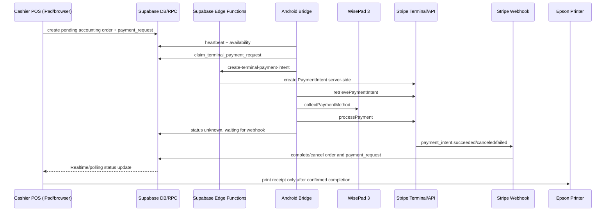
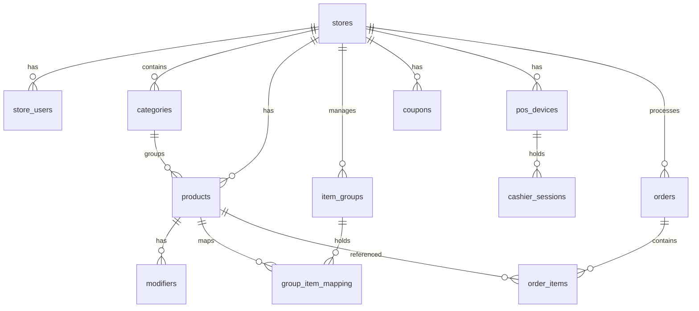

# Cashpilot POS - Comprehensive System Architecture & Code Structure Documentation

This document provides a complete, updated breakdown of the current architecture, tech stack, database schema, file layouts, and detailed code implementations of the **Cashpilot POS (Point of Sale)** system.

---

## 1. System Architecture & Tech Stack

### Frontend
- **Core Identity:** React/Vite web application (POS, Store Backoffice, and Master modes), plus a companion native Android payment bridge for Bluetooth Stripe Terminal readers. There is no desktop executable.
- **Framework:** React.js initialized via Vite.
- **Styling:** Tailwind CSS with dynamic themes (Light/Dark Mode toggle) and RTL (Arabic-first) UI/UX direction support.
- **Icons:** `lucide-react` for modern, scalable iconography.
- **HTTP Client:** Native `fetch` API and `@supabase/supabase-js` client SDK for direct queries and real-time database subscriptions.
- **Build Mode & Hostname Routing:** Detects whether the app runs in backoffice central SaaS mode (`cashmint.online`, its subdomains, or `VITE_APP_MODE=master`) or standard POS terminal mode. Implements lazy loading (`React.lazy` and `Suspense`) for dashboards to support code-splitting and optimize bundle sizes. Each hosted site must receive its matching mode-specific build output; build directories are not interchangeable.
- **Session Lifecycle & Stale Data Cleanup:** Clears all cached user data and terminal sessions from `localStorage` if a login switch is detected. Employs automatic 401/expired JWT token handling to log out and refresh the app.


### Backend & Database
- **Database:** Supabase (PostgreSQL instance).
- **Security:** Tenant-scoped RLS policies and RPC endpoints are defined in version-controlled migrations. The deployed Supabase project's RLS state must be verified after every migration; do not assume a local SQL file has been applied to production.
- **Database Migrations:** SQL migration files located in `supabase/migrations/` manage schema changes version-by-version.
- **Serverless Functions:** Supabase Edge Functions (Deno runtime) for API webhooks, AI business analytics, user administration, and menu extraction.

### Third-Party Integrations
1. **Stripe Terminal via Android Bridge (active payment system):**
   - The active card-payment path is `stripe_android_bridge`, configured per restaurant location in `restaurant_payment_configs` and processed by the Android bridge and a Stripe Terminal reader.
   - Stripe Connect tables/functions remain in the repository but are not the active POS payment flow. The legacy browser-local Stripe form is not active and must not be treated as a payment configuration.
2. **Payments Deep Linking (Viva Wallet & SumUp):**
   - Supports deep linking to external payment provider apps (Viva Wallet/SumUp) using native device URI schemes.
3. **Stripe Android Payment Bridge (BBPOS WisePad 3):**
   - The POS does not communicate directly with the Android phone or reader. The flow is: `POS -> Supabase payment request -> Android Bridge -> Stripe reader -> Supabase status update -> POS`.
   - The Android bridge enrols with a single-use Backoffice code, receives a dedicated Supabase Auth session, then sends `bridge_heartbeat` every 20 seconds and listens for payment requests through Realtime plus reconciliation polling.
   - The Card / Visa choice in the POS is enabled only when the server reports an enabled `stripe_android_bridge` configuration and a terminal device with `status = online`, `reader_status = connected`, and a heartbeat no older than 60 seconds. A locally connected reader is not sufficient if the bridge cannot update Supabase.
   - Android Bridge version **1.0.16** protects the periodic loop from uncaught exceptions, immediately sends a heartbeat after the reader connects, separates reader connection state from payment action state, validates Supabase Auth JWTs before Realtime connects, treats Stripe final failures as final, prevents completed/cancelled requests from replaying, and keeps REST polling as the fallback when Realtime is unavailable. Its source lives in `android-payment-bridge/`; the APK must be rebuilt and installed before the device receives Android-side updates.
4. **Cloud Order Webhook:** HubRise API order webhooks.
5. **Local Hardware Printing (Epson TM-T20IV & TM-M30):**
   - Sends ePOS-Print XML commands over SOAP POST requests to the local printer IP using a secure HTTPS endpoint (`https://{IP}/cgi-bin/epos/service.cgi`).
   - Generates cash drawer triggers using the ESC/POS pulse tag `<pulse drawer="drawer_1" time="pulse_100"/>` as well as the fallback `<drawer pulse="1"/>` command.
   - **Silent Iframe Fallback:** Handles browser CORS/mixed-content blocks by automatically falling back to rendering receipts on a hidden 72mm iframe using browser print mechanics (`window.print()`).
5. **AI Assistants:** Dahl API inference engine using the `moonshotai/Kimi-K2.6` model.
   - **AI Menu OCR Assistant:** Scans menus (Image/PDF) to generate structured categories, item groups, and products.
   - **AI Business Analyst:** Interactive cashier sidebar widget analyzing sales trends, products, and operational configurations. Supports cashier permissions (`ai_enabled` toggle) and Super Admin global bypass mode.
6. **Promo Code / Coupon System:**
   - Evaluates active coupons in real-time. Cashiers enter promo codes to calculate percentage or fixed discounts directly on the checkout screen.
7. **POS Device Authentication & Health Monitoring:**
   - Registers terminals using unique shortcodes, querying the `pos_devices` table.
   - Subscribes to real-time `DELETE` or `UPDATE` events on the active terminal row, immediately executing a clean local logout and shift closure if the device is revoked or deactivated.
   - Runs a backup background polling health check every 20 seconds to confirm the device is still active.


---

## 2. System Process Map

This section describes the runtime processes that move through the whole system. It is the operational view of the architecture: who starts the process, what data moves, which component is authoritative, and where completion is recorded.

### 2.1 Hosted App Startup and Mode Selection
1. The browser loads the Vite React bundle from the deployed domain.
2. The app determines its mode from hostname and `VITE_APP_MODE`:
   - `pos` for cashier terminals.
   - `store` for store backoffice.
   - `master` for central SaaS administration.
3. The matching dashboard is lazy-loaded. POS, Store Backoffice, and Master are intentionally separated at runtime even though they share the same source repository.
4. On login/account switch, cached terminal and user data is cleared from `localStorage` to prevent one user's store/device state from leaking into another session.

### 2.2 POS Device Activation and Cashier Session
1. A POS terminal starts at the activation/login screen.
2. The cashier enters a device activation code.
3. The browser calls `verify_pos_device_activation(code_input)` instead of reading `pos_devices` directly.
4. Supabase validates that the device exists, belongs to a store, and is active.
5. The POS stores only the device/session context needed for that terminal.
6. The terminal sends periodic device heartbeats through `touch_pos_device(device_uuid)`.
7. If the device is revoked or deleted, the POS receives a Realtime event or detects it through polling, closes the local session, and logs out.
8. Cashier shifts are tracked in `cashier_sessions`; sales totals are accumulated from completed orders, not from local-only browser state.

### 2.3 Catalog Loading and Menu State
1. The POS asks Supabase for the active device's catalog through `get_pos_catalog(device_uuid)`.
2. Supabase returns only tenant-owned categories, products, modifiers, and related option data for the active device's store.
3. The browser renders the menu and maintains the cart locally for speed.
4. Cart totals shown in the browser are a preview. Final prices, coupons, VAT, receipt numbers, and accounting snapshots are calculated server-side during checkout.

### 2.4 Cash Checkout
1. The cashier chooses cash.
2. The POS sends the cart, order type, coupon code, cashier/device context, and payment method to `create_accounting_order`.
3. The RPC reloads products/modifiers from the database, validates ownership, resolves VAT from Accounting Group -> Tax Profile -> Tax Rate, applies the coupon, and verifies totals.
4. The RPC creates:
   - `orders` row with immutable receipt/order snapshots.
   - `order_items` rows with immutable product/tax snapshots.
   - `payments` row marked successful for cash.
   - updated receipt counter.
5. The browser receives the completed order and starts the receipt printing process.
6. Cash orders can complete without Stripe because the server-side accounting RPC is the final authority for cash settlement.

### 2.5 Stripe Terminal Card Checkout Overview
Card checkout is split across the POS browser, Supabase, the Android bridge, Stripe Terminal, Stripe webhook, and printer. The browser never talks directly to the WisePad 3 and never marks a card order paid by itself.

High-level flow:



### 2.6 Card Availability Process
1. A Backoffice or deployment process configures `restaurant_payment_configs` with the active `stripe_android_bridge` provider and non-secret Stripe routing data such as `stripe_location_id`.
2. The Android bridge must be enrolled, authenticated, connected to the WisePad 3, and sending heartbeat updates.
3. `bridge_heartbeat` updates `terminal_devices.status`, `reader_status`, `last_heartbeat_at`, app version, and current active payment request ID.
4. The POS calls `terminal_payment_availability` on startup and periodically.
5. The Visa/Card button is enabled only when Supabase reports:
   - active `stripe_android_bridge` configuration.
   - online terminal device.
   - connected reader.
   - fresh heartbeat, normally within 60 seconds.
6. If Realtime is blocked, unavailable, or returns 403, REST polling remains the fallback. Card availability and payment reconciliation must not depend on Realtime alone.

### 2.7 Android Bridge Enrollment Process
1. An authorized Backoffice user generates an enrollment code through `create-terminal-enrollment-code`.
2. The code is short-lived and intended for provisioning the Android bridge without sharing store staff credentials.
3. The Android bridge opens its enrollment UI and submits:
   - Supabase URL.
   - Supabase anon key.
   - enrollment code.
   - display name.
4. `register-terminal-device` redeems the code, validates the mapped restaurant/location/configuration, creates or updates the `terminal_devices` row, and returns a dedicated Supabase Auth session to the Android app.
5. Android stores the bridge session in encrypted local storage via `BridgeCredentials`.
6. After enrollment, Android can refresh its own session without exposing any Stripe secret key or Supabase service-role key.
7. Reset enrollment clears the local bridge credentials and requires a fresh code before the bridge can operate again.

### 2.8 WisePad 3 Discovery and Connection Process
1. The operator turns on the WisePad 3 and keeps it near the Android phone.
2. Android initializes Stripe Terminal SDK with a server-generated connection token from `terminal-connection-token`.
3. The bridge uses physical WisePad 3 discovery only; the simulated reader path is not part of live operation.
4. The operator taps `Discover / reconnect WisePad 3`.
5. Android discovers available Bluetooth readers and connects to the first valid Stripe reader for the configured Stripe Terminal location.
6. When the reader connects, Android marks `reader_status = connected` through heartbeat.
7. If Stripe reports an already-connected/stale reader state, Android attempts a safe disconnect/reconnect path.
8. If discovery is cancelled by the user, the app reports cancellation but does not create or replay any payment.

### 2.9 Card Payment Request Creation
1. The cashier builds a cart and chooses Visa/Card.
2. The browser creates a pending accounting order and a `payment_requests` row. Amount, currency, restaurant, location, order ID, and payment configuration are server-derived.
3. The browser shows a payment modal instructing the customer to use the WisePad 3.
4. The POS waits for server-confirmed status changes through Realtime and polling.
5. The POS does not mark the order as paid, even if the Android bridge reports local SDK success.

### 2.10 Atomic Claim and One Active Payment
1. The Android bridge periodically checks for eligible `payment_requests` for its assigned location.
2. The bridge uses `claim_terminal_payment_request` to atomically claim one request.
3. The claim RPC prevents two bridge devices from processing the same request.
4. Android stores the active request ID locally while processing.
5. The bridge keeps one payment active at a time. New pending requests wait until the active request is released, completed, failed, cancelled, or expires.

### 2.11 PaymentIntent Creation and Reader Collection
1. After claiming a request, Android calls `create-terminal-payment-intent`.
2. The Edge Function loads the request and configuration, derives amount/currency/server metadata, and creates a Stripe PaymentIntent using server-side credentials.
3. The function stores the Stripe PaymentIntent ID and client secret on `payment_requests`.
4. Android retrieves the PaymentIntent using Stripe Terminal SDK.
5. Android calls `collectPaymentMethod`, which moves interaction to the WisePad 3 screen.
6. The customer taps, inserts, or swipes the card/Apple Pay on the WisePad 3.
7. Android then calls `processPayment`.
8. After SDK processing returns success, Android marks the request `unknown` and waits for Stripe webhook confirmation. This prevents Android from being the final payment authority.

### 2.12 Webhook Confirmation and Order Completion
1. Stripe sends webhook events to `stripe-terminal-webhook`.
2. The webhook verifies the event with the Stripe webhook secret.
3. The webhook retrieves/verifies the PaymentIntent status from Stripe before changing order state.
4. For `succeeded`, the webhook calls the accounting completion path and marks:
   - `payment_requests.status = succeeded`.
   - related `payments.status = succeeded`.
   - related `orders.status = completed`.
5. For `canceled`, the webhook marks the request/order payment path cancelled without marking the order paid.
6. For `requires_payment_method`, the webhook marks the request `failed`. It does not put the request back into `waiting_for_card`, because that would replay the same amount and cause loops.
7. The POS sees the server-confirmed final status and closes the card modal.
8. Receipt printing starts only after the order is server-confirmed as completed.

### 2.13 Cancellation, Decline, Timeout, and Unknown-State Recovery
1. If the cashier cancels from the POS or Android, `cancel-terminal-payment` requests cancellation through Stripe when a PaymentIntent exists.
2. The cancel function then updates `payment_requests.status = cancelled` unless the request has already succeeded.
3. Android also cancels any active Stripe Terminal SDK operation when it has a local cancelable operation.
4. If a card is declined or the reader times out, Stripe may return `requires_payment_method`.
5. Android version 1.0.16 treats `requires_payment_method` as a final failed attempt for that payment request. It does not keep waiting on the same PaymentIntent after Stripe says a new payment method is required.
6. The bridge does not automatically call `collectPaymentMethod` again for the same request.
7. If Stripe returns `requires_confirmation`, Android retries `processPayment` once against the already-collected PaymentIntent and then enters unknown-state reconciliation instead of collecting the card again.
7. The cashier must press Visa/Card again to create a new payment request if the customer wants another attempt.
8. If Android or the network crashes after processing, `retrieve-terminal-payment-status` and the webhook reconcile the PaymentIntent state so the system does not rely on local app memory.

### 2.14 Receipt Printing Process
1. The POS prints only after a completed order exists in Supabase.
2. The primary printer path sends Epson ePOS-Print XML to the configured local printer endpoint.
3. The print payload includes receipt lines, totals, VAT, payment method, and cash drawer pulse commands where applicable.
4. Automatic production receipt printing should use direct Epson ePOS where possible and avoid browser print prompts.
5. If direct ePOS fails and fallback is allowed, the browser renders a hidden iframe receipt and calls `window.print()`. That fallback can show the iPad print popup and depends on browser/iOS print behavior.
6. Manual test print and reprint flows may intentionally open browser print UI depending on the selected print path.
7. Printing is downstream of payment confirmation: a failed printer does not mark a payment failed, and a successful payment should remain recorded even if receipt printing needs retry.

### 2.14.1 Receipt Language Isolation
1. Receipt templates are stored in `receipt_templates.config_json`; the persisted receipt-language field is `config_json.language_mode` (`en`, `ar`, `fr`, or `nl`). No separate database column is required.
2. The current default is `pos_language`. In `src/admin/ReceiptDesigner.jsx:103-105`, `pos_language` resolves through the `isArabic` prop, which is the global application language state rather than an independent receipt-language state.
3. The same coupling is repeated by `src/components/admin/ReceiptPreview.jsx:13-19` and `src/utils/printerService.js:202-205` / `440-444`; therefore changing the Backoffice language can change receipt preview and printed content whenever `language_mode` is `pos_language`.
4. The global UI language is persisted as `localStorage.app_language` in `src/App.jsx:462-470`, and is passed through `AdminDashboard` into `ReceiptDesigner` (`src/App.jsx:2770-2782`, `src/admin/AdminDashboard.jsx:478-482`).
5. Required architecture: Backoffice UI language and receipt language must be independent. Explicit receipt selections (`en`, `ar`, `fr`, `nl`) must be honored by preview, Epson XML, iframe fallback, reprint, and diagnostics regardless of `app_language`.
6. Minimal corrective change: keep `config_json.language_mode` as the source of truth, stop resolving `pos_language` from `isArabic`, use a concrete receipt-language default, and remove the runtime `isArabic` dependency from receipt-language selection. `isArabic` may remain for Backoffice labels, notifications, and UI direction only.

### 2.15 Realtime, Polling, and Recovery Loops
1. Realtime is used for fast UI and bridge updates.
2. REST polling is always retained as fallback because mobile networks, browser WebSockets, and Supabase Realtime permissions can fail.
3. The Android bridge loop runs every 20 seconds and is protected from uncaught exceptions so one failure does not kill future heartbeats or reconciliation.
4. The POS also refreshes availability and order/payment status periodically.
5. Final statuses (`succeeded`, `failed`, `cancelled`, `expired`) must release local active state and must not be reclaimed.
6. Non-final uncertain statuses are reconciled through Stripe status lookup and webhook verification, not by creating duplicate charges.

### 2.16 Backoffice Administration Processes
1. Store users manage catalog, categories, products, modifiers, combo components, tax profiles, payment settings, printer settings, coupons, and onboarding.
2. Catalog edits are tenant-scoped through RLS.
3. Tax settings must be complete before checkout; the server rejects checkout if a product cannot resolve a valid accounting group/profile/rate.
4. Backoffice can generate Android bridge enrollment codes but does not expose Stripe secret keys.
5. Test print validates the configured local printer path independently from payment success.

### 2.17 Master/Superadmin Processes
1. Master mode loads central dashboards for platform administration.
2. Superadmin user management uses service-role Edge Functions rather than exposing service-role credentials to the browser.
3. Superadmin catalog tools can manage tenant catalog data through controlled admin UI paths.
4. Global system settings, maintenance mode, and platform analytics are managed outside the POS cashier flow.

### 2.18 AI and Import Processes
1. The AI menu assistant accepts image/PDF input from Backoffice, sends it to the `ai-menu-assistant` Edge Function, and returns structured categories/products/options.
2. The browser reviews and inserts generated catalog records through normal tenant-scoped APIs.
3. The AI business analyst calls `ai-business-analyst`, which scopes analysis to either the mapped store or superadmin platform view.
4. CSV import sanitizes delimiter and price formatting locally, then inserts structured catalog rows for the mapped tenant.

### 2.19 Accounting Export and Daily Closing Process
1. Completed orders write immutable order, payment, tax, product, and receipt snapshots.
2. Accountant exports read tenant-scoped views for sales transactions, VAT summaries, and payment summaries.
3. Daily closing creates an immutable snapshot for a store/day and locks the summarized numbers for accountant review.
4. Historical orders are not rewritten when catalog names, prices, tax profiles, or products later change.

### 2.20 Deployment Process
1. Frontend builds are mode-specific:
   - `npm run build:pos` for the POS domain.
   - `npm run build:store` for store backoffice.
   - `npm run build:master` for central SaaS.
2. Supabase Edge Function changes must be deployed with `npx supabase@latest functions deploy <function-name> --project-ref <project-ref>`.
3. Database changes require reviewed migrations; do not use `db push` against divergent production history.
4. Android bridge changes require rebuilding the APK and installing it on the Android phone through ADB or another controlled installation process.
5. Runtime payment fixes often need both APK installation and Edge Function deployment; frontend redeploy is needed only when browser source or production build artifacts changed.

---

## 3. Database Schema

The database is built on PostgreSQL inside Supabase. Table structures are defined by migrations in `supabase/migrations/`. Below is the entity relationship diagram representing the primary tables:



### Table Definitions:
1. **`stores`**: Represents store tenants. Contains attributes like `id` (UUID), `name` (TEXT), `business_type` (TEXT), integration and branding fields, `timezone` (TEXT, default `Europe/Brussels`), `currency` (TEXT, default `EUR`), `theme_config` (JSONB), `onboarding_status` (TEXT), `onboarding_completed` (BOOLEAN), `onboarding_completed_at` (TIMESTAMPTZ), and `created_at` (TIMESTAMPTZ).
2. **`store_users`**: Maps users to stores. Contains `id` (UUID), `user_id` (UUID), `store_id` (UUID, foreign key references `stores`), `role` (`admin` or `cashier`), `ai_enabled` (BOOLEAN, defaults to `false`), and `created_at` (TIMESTAMPTZ).
3. **`categories`**: Menu groups with `default_accounting_group_id`. New products inherit this group when no product-specific group is supplied. A category default never overwrites an explicit product exception.
4. **`products`**: Sellable items with `accounting_group_id` and `accounting_group_is_override`. The first is the product's tax source; the second marks a manual override that is preserved when a category default is bulk-applied. The legacy `vat_rate` column is compatibility-only.
5. **`modifiers`**: Product add-ons. Contains `id` (UUID), `product_id` (UUID, foreign key references `products`), `name` (TEXT), and `price_adjustment` (NUMERIC, defaults to `0.00`).
6. **`orders`**: Checkout receipts. Contains `id` (UUID), `store_id` (UUID, foreign key references `stores`), `status` (`new` for cloud orders, `pending` for unpaid card orders, `completed`, `cancelled`), `total_amount` (NUMERIC), `raw_payload` (JSONB description of items, order type, applied coupon details, timestamp), and `created_at` (TIMESTAMPTZ).
7. **`order_items`**: Junction mapping for orders. Contains `id` (UUID), `order_id` (UUID, foreign key references `orders`), `product_id` (UUID, foreign key references `products`), `quantity` (INTEGER), `price` (NUMERIC, defaults to `0.00`), `subtotal` (NUMERIC), and `store_id` (UUID, foreign key references `stores`).
8. **`item_groups`**: Option groups for products (e.g. burger extras, side choices). Contains `id` (UUID), `name` (TEXT), `sku` (TEXT), `is_required` (BOOLEAN), `min_items` (INTEGER), `max_items` (INTEGER), `price_strategy` (`keep_initial` or `set_price`), `group_price` (NUMERIC), `store_id` (UUID, foreign key references `stores`), and `created_at` (TIMESTAMPTZ).
9. **`group_item_mapping`**: Maps catalog products into option groups. Contains `id` (UUID), `group_id` (UUID, foreign key references `item_groups`), `product_id` (UUID, foreign key references `products`), `override_price` (NUMERIC), `store_id` (UUID, foreign key references `stores`), and `created_at` (TIMESTAMPTZ).
10. **`coupons`**: Discount promo codes. Contains `id` (UUID), `store_id` (UUID, foreign key references `stores`), `code` (TEXT), `discount_type` (`percentage` or `fixed`), `discount_value` (NUMERIC), `is_active` (BOOLEAN, default true), and `created_at` (TIMESTAMPTZ). Unique per store code.
11. **`pos_devices`**: Represents registered POS hardware terminal devices mapped to stores. Contains `id` (UUID), `store_id` (UUID, foreign key references `stores`), `device_name` (TEXT), `activation_code` (TEXT, unique), `status` (TEXT, 'active' or 'revoked'), `last_active_at` (TIMESTAMPTZ), and `created_at` (TIMESTAMPTZ).
12. **`cashier_sessions`**: Tracks open cashier shifts and sessions per POS device. Contains `id` (UUID), `device_id` (UUID, foreign key references `pos_devices`), `cashier_name` (TEXT), `status` (TEXT, 'open' or 'closed'), `opened_at` (TIMESTAMPTZ), `closed_at` (TIMESTAMPTZ), `opening_balance` (NUMERIC), `total_sales` (NUMERIC, default 0.00), `cash_balance` (NUMERIC, default 0.00), `metadata` (JSONB, default `{}`), and `created_at` (TIMESTAMPTZ).
13. **`system_settings`**: Global platform configurations. Contains `id` (INTEGER, primary key), `maintenance_mode` (BOOLEAN, defaults to `false`), and `auto_backup` (BOOLEAN, defaults to `true`).
14. **`store_receipt_counters`**: Holds the next sequential receipt number for each store.
15. **`payments`**: Payment records linked to orders, including method, status, amount, provider reference, processor fee, net settlement, and payment time.
16. **`refunds`**: Refund audit records linked to the original order and, when applicable, its order line, with net/VAT/gross amounts and the reason.
17. **`daily_closings`**: Immutable per-store daily-closing snapshots with receipt range, sales totals, VAT and payment breakdowns, and locking state.
18. **`stripe_connect_connections`**: One connected Stripe Standard account per store, storing the account ID, scope, mode, and connection lifecycle metadata—never Stripe credentials or OAuth tokens.
19. **`stripe_connect_states`**: Short-lived, single-use server-side OAuth state records binding a Connect callback to the initiating user and store.
20. **`tax_rates`, `tax_profiles`, and `accounting_groups`**: Tenant-scoped VAT configuration. A product's Accounting Group maps to a Tax Profile, which resolves a rate by order type. The database supports `dine_in`, `takeaway`, and `delivery`; the current POS exposes only Dine-in and Takeaway. Delivery remains a database/server order type for connected ordering channels and future use.
21. **`terminal_devices`**: Android payment-bridge registrations. Each record belongs to a restaurant location and payment configuration, has a unique bridge Auth identity, and stores `status`, `reader_status`, `last_heartbeat_at`, app version, active request ID, and safe operational error state. This is the server-side source of truth for POS card availability.
22. **`terminal_enrollment_codes`**: Short-lived, single-use codes created by an authorized Backoffice user to provision a bridge device without exposing a store user's credentials.
23. **`payment_requests`**: Server-created card-payment work items. The bridge may claim and update the request, but amounts and final order settlement remain server-side.

The accounting migration also adds immutable receipt, payment, cashier/device, currency, discount, and tax-snapshot fields to `orders` and `order_items`. These fields make reports independent of later catalog edits.

### Trusted checkout accounting

`create_accounting_order` is the authoritative checkout write path. Frontend VAT is a display preview only: the RPC ignores client-submitted prices, VAT, totals, and discounts. It loads store-owned products and modifiers, resolves each tax rate from the product Accounting Group and Tax Profile for the order type, derives coupons server-side, and persists immutable receipt snapshots. A sale is rejected with `TAX_CONFIGURATION_MISSING` rather than falling back to a fixed VAT rate.

For a Combo/Bundle, `product_bundle_components` expands the sellable combo into component order lines. The server allocates the combo price using each component's reference price multiplied by its `allocation_weight`, resolves VAT per component, and saves the component's tax/accounting snapshots plus bundle ID, bundle name, and allocation-weight snapshot. This keeps mixed-VAT bundles correct even after the catalog or tax setup changes.

### 3.1 Database Migrations

The database structure evolves incrementally through version-controlled SQL files located in `supabase/migrations/`:

1. **`20260708000000_init_core_schema.sql`**: Initializes the baseline relational structure for the multi-tenant SaaS application, setting up `stores`, `store_users`, `categories`, `products`, `modifiers`, `orders`, `order_items`, `item_groups`, and `group_item_mapping` tables.
2. **`20260715000000_fix_stores_rls.sql`**: Hardens Row Level Security (RLS) policies for stores, products, categories, modifiers, and option mappings to strictly enforce tenant separation.
3. **`20260715010000_create_coupons_table.sql`**: Creates the `coupons` table and implements RLS rules, allowing authenticated cashiers to select active coupons and store admins to manage them.
4. **`20260715940000_fix_storage_policies.sql`**: Secures `storage.objects` policies for the `logos` bucket, restricting uploads to authenticated users and management (update/delete) to authorized store administrators.
5. **`20260715950000_add_status_enums.sql`**: Introduces custom PostgreSQL status enums (`cashier_session_status` and `pos_device_status`) and converts columns in `cashier_sessions` and `pos_devices` to use these types.
6. **`20260715960000_add_missing_indexes.sql`**: Generates performance indexes on foreign key mappings and search parameters (`idx_products_store_id`, `idx_orders_created_at`, etc.) for query optimization.
7. **`20260715970000_add_auth_users_fk.sql`**: Links `public.store_users.user_id` to Supabase auth accounts (`auth.users`) using a foreign key constraint with cascade deletions.
8. **`20260715970500_secure_cashier_sessions.sql`**: Implements fine-grained security policies on cashier sessions, permitting shift activation via device verification and restricts write control to tenant members.
9. **`20260715971000_secure_pos_devices_activation.sql`**: Hardens terminal registration security, introducing the secure RPC function `verify_pos_device_activation` and defining strict read/write policies for POS devices.
10. **`20260715972000_secure_stores_policies.sql`**: Implements tenant validation for store information, allowing new users without stores to create a store row, and giving complete CRUD overrides to superadmins.
11. **`20260715975000_fix_store_users_recursion.sql`**: Eliminates circular dependency recursion errors in RLS checks for `store_users` by using a security definer helper function `check_user_is_store_admin`.
12. **`20260715980000_enable_rls_on_all_tables.sql`**: Explicitly enables Row Level Security across all public relational tables in the PostgreSQL database.
13. **`20260715990000_add_superadmin_function.sql`**: Establishes `is_superadmin()` security checking functions to identify administrative users based on their role in mapping tables or specific email domains.
14. **`20260716000000_create_pos_devices_and_sessions.sql`**: Creates tables `pos_devices` and `cashier_sessions` to facilitate hardware locking and shift accounting (since secured by subsequent migrations).
15. **`20260716000100_create_system_settings.sql`**: Creates the `system_settings` table to track global configurations like maintenance blocks, limiting management controls to superadmins.
16. **`20260716010000_add_metadata_to_cashier_sessions.sql`**: Adds a JSONB `metadata` column to cashier sessions for tracking dynamic shift information.
17. **`20260716010000_add_user_helper_functions.sql`**: Introduces secure resolver utilities (`get_user_email` and `resolve_user_email`) and adds `store_users` to the real-time replication publication.
18. **`20260716020000_add_ai_enabled_column.sql`**: Adds an `ai_enabled` permission boolean to `store_users` to control cashier sidebar access to the business assistant.
19. **`20260716020000_add_sales_columns_to_cashier_sessions.sql`**: Extends the shift ledger system by adding `total_sales` and `cash_balance` columns to the `cashier_sessions` schema.
20. **`20260717000000_store_deletion_cleanup.sql`**: Registers the `handle_store_deletion_cleanup()` trigger to clean up auth accounts in `auth.users` when a tenant store is deleted (ensuring users are not mapped elsewhere).
21. **`20260717010000_add_orders_rls_policies.sql`**: Restricts the `orders` and `order_items` queries, allowing only store members and global platform superadmins to select or insert transactions.
22. **`20260717233429_accounting_exports.sql`**: Adds accounting snapshots, sequential receipts, payment/refund and daily-closing tables, tenant-scoped reporting views, and transactional checkout/settlement RPCs.
23. **`20260718000000_secure_pos_catalog_rpc.sql`**: Adds POS-device RPC endpoints for activation verification, heartbeat updates, and catalog loading (`verify_pos_device_activation`, `touch_pos_device`, and `get_pos_catalog`) plus tenant-scoped catalog policies. These are additive changes and do not modify existing rows.
24. **`20260718001904_store_level_onboarding.sql`**: Adds persisted store onboarding and theme fields, membership-scoped store/logo policies, and the `save_store_onboarding` RPC.
25. **`20260718002255_enable_store_membership_rls.sql`**: Ensures RLS is enabled for the stores and membership tables used by onboarding.
26. **`20260718002340_secure_onboarding_rpc_grants.sql`**: Revokes anonymous access to the onboarding RPC and grants it only to authenticated users.
27. **`20260718002523_tighten_logo_listing.sql`**: Removes broad logo-object listing access from the public bucket.
28. **`20260718003815_fix_logo_storage_upsert_policy.sql`**: Adds the scoped Storage SELECT policy required for authenticated logo replacement via upsert.
29. **`20260718010000_add_terminal_payments.sql`**: Adds restaurant/location payment configuration, terminal devices, payment requests, and the Android Stripe Terminal foundation.
30. **`20260718010000_stripe_connect_architecture.sql`**: Adds Stripe Connect account/state tables, tenant-safe read access, and blocks all browser writes to the OAuth state and connection records.
31. **`20260718020000_accounting_groups_tax_profiles.sql`**: Adds editable tax rates/profiles/accounting groups, Belgium-oriented review templates, cross-store integrity checks, and non-destructive legacy product assignment. It does not alter historical order snapshots.
32. **`20260718020000_terminal_enrollment_codes.sql`**: Adds single-use terminal enrollment codes and the bridge enrollment/heartbeat authorization model.
33. **`20260718022000_trusted_tax_checkout.sql`**: Introduces the trusted `create_accounting_order` tax-aware checkout path.
34. **`20260718030000_accounting_groups_need_configuration.sql`**: Allows `tax_profile_id` to be nullable in `accounting_groups` for initial category/group catalog setup, enforcing store-level checks.
35. **`20260718190000_terminal_bridge_hardening.sql`** and **`20260718210000_restaurant1_terminal_payment_deploy.sql`**: Harden and deploy terminal bridge/payment behavior.
36. **`20260719010000_category_tax_defaults_and_bundle_components.sql`**: Adds category default Accounting Groups and `product_bundle_components`.
37. **`20260719020000_tax_safe_combos_and_category_overrides.sql`**: Adds product override protection, bundle component snapshots, safe category bulk-apply, and server-side combo VAT allocation.
38. **`20260719020514_allow_store_users_to_check_terminal_availability.sql`**: Allows mapped store users to call `terminal_payment_availability` while preserving the terminal's own authorization path.
39. **`20260719030000_pos_bundle_tax_preview.sql`**: Includes bundle components in the POS catalog so the browser can display a per-component VAT preview; checkout remains server-authoritative.
40. **`20260719084000_terminal_card_completion_rpcs.sql`**: Ensures Stripe Terminal webhooks can complete or cancel accounting card orders through `complete_accounting_card_payment` and `cancel_accounting_card_payment` security-definer RPCs.
41. **`20260719093000_terminal_pos_payment_result_rpc.sql`**: Exposes terminal payment result lookup RPC for POS client.
42. **`20260719150000_terminal_payment_state_guards.sql`**: Enforces state transition guards on terminal payment requests.
43. **`20260719162348_nullable_product_vat_rate_legacy_fallback.sql`**: Provides legacy fallback for nullable product VAT rates.
44. **`20260719163000_terminal_reader_recovery_states.sql`**: Adds terminal reader state recovery RPCs.
45. **`20260720000000_split_payments_schema.sql`**: Adds split payments database schema (`payment_splits` and `payment_split_parts`).
46. **`20260720010000_split_payments_rpcs.sql`**: Adds atomic split payment creation, processing, and completion RPCs.
47. **`20260720020000_allow_split_in_create_accounting_order.sql`**: Extends `create_accounting_order` RPC to support split payment method transactions.
48. **`20260720030000_restore_create_accounting_order_validations.sql`**: Restores strict tax and coupon validations in `create_accounting_order`.
49. **`20260720040000_fix_terminal_payment_conflict_target.sql`**: Fixes conflict target in terminal payment upserts.
50. **`20260720_receipt_templates.sql`**: Creates thermal receipt templates table and default layout settings.
51. **`20260720_update_receipt_templates_check.sql`**: Updates receipt template check constraints.
52. **`20260721153000_superadmin_upgrades.sql`**: Adds Superadmin global analytics RPC and platform audit logging.
53. **`20260721160000_system_health.sql`**: Adds system health monitoring RPCs.
54. **`20260721170000_fix_is_superadmin.sql`**: Hardens `is_superadmin()` security definer helper function.
55. **`20260721180000_corrective_upgrades.sql`**: Corrects global analytics queries and adds store split payment feature flag sync trigger.
56. **`20260721190000_revoke_unnecessary_privileges.sql`**: Revokes default public DDL/DML permissions from sensitive tables.
57. **`20260721200000_add_role_check_constraint.sql`**: Enforces strict role check constraint (`admin`, `cashier`, `superadmin`) on `store_users`.
58. **`20260722010000_enable_rls_core_pos_tables.sql`**: Enables RLS on `categories`, `products`, `pos_devices`, and `cashier_sessions`, revokes dangerous privileges (`TRUNCATE`, `TRIGGER`, `REFERENCES`), and restricts unauthenticated table access.
59. **`20260722011000_sanitize_pos_catalog_store_payload.sql`**: Hardens `get_pos_catalog(uuid)` with `search_path = public, pg_temp` and excludes `hubrise_api_key`.
60. **`20260722012000_whitelist_pos_catalog_store_fields.sql`**: Explicitly whitelists approved POS-facing store payload fields in `get_pos_catalog(uuid)` using `jsonb_build_object` to prevent accidental sensitive key exposure.

---

## 4. Directory File Structure

The project has the following file structure:

```
cashpilot/
├── .env                              # Production Supabase credentials & configurations
├── .env.master                       # Configures VITE_APP_MODE=master (Superadmin central mode)
├── .env.pos                          # Configures VITE_APP_MODE=pos (POS Terminal mode)
├── index.html                        # Main HTML template wrapper
├── package.json                      # Node packages configurations
├── vite.config.js                    # Vite bundler rules
├── seed.sql                          # Database menu data seed script
├── gemini.md                         # POS System Architecture Rules
├── app_structure_documentation.md    # Active architectural documentation
├── supabase/
│   ├── migrations/                   # SQL Schema and RLS Policies Migrations
│   │   ├── 20260708000000_init_core_schema.sql
│   │   ├── 20260715000000_fix_stores_rls.sql
│   │   ├── 20260715010000_create_coupons_table.sql
│   │   ├── 20260715940000_fix_storage_policies.sql
│   │   ├── 20260715950000_add_status_enums.sql
│   │   ├── 20260715960000_add_missing_indexes.sql
│   │   ├── 20260715970000_add_auth_users_fk.sql
│   │   ├── 20260715970500_secure_cashier_sessions.sql
│   │   ├── 20260715971000_secure_pos_devices_activation.sql
│   │   ├── 20260715972000_secure_stores_policies.sql
│   │   ├── 20260715975000_fix_store_users_recursion.sql
│   │   ├── 20260715980000_enable_rls_on_all_tables.sql
│   │   ├── 20260715990000_add_superadmin_function.sql
│   │   ├── 20260716000000_create_pos_devices_and_sessions.sql
│   │   ├── 20260716000100_create_system_settings.sql
│   │   ├── 20260716010000_add_metadata_to_cashier_sessions.sql
│   │   ├── 20260716010000_add_user_helper_functions.sql
│   │   ├── 20260716020000_add_ai_enabled_column.sql
│   │   ├── 20260716020000_add_sales_columns_to_cashier_sessions.sql
│   │   ├── 20260717000000_store_deletion_cleanup.sql
│   │   ├── 20260717010000_add_orders_rls_policies.sql
│   │   ├── 20260717233429_accounting_exports.sql
│   │   ├── 20260718000000_secure_pos_catalog_rpc.sql
│   │   ├── 20260718001904_store_level_onboarding.sql
│   │   ├── 20260718002255_enable_store_membership_rls.sql
│   │   ├── 20260718002340_secure_onboarding_rpc_grants.sql
│   │   ├── 20260718002523_tighten_logo_listing.sql
│   │   ├── 20260718003815_fix_logo_storage_upsert_policy.sql
│   │   ├── 20260718010000_add_terminal_payments.sql
│   │   ├── 20260718010000_stripe_connect_architecture.sql
│   │   ├── 20260718020000_accounting_groups_tax_profiles.sql
│   │   ├── 20260718020000_terminal_enrollment_codes.sql
│   │   ├── 20260718022000_trusted_tax_checkout.sql
│   │   ├── 20260718030000_accounting_groups_need_configuration.sql
│   │   ├── 20260718190000_terminal_bridge_hardening.sql
│   │   ├── 20260718210000_restaurant1_terminal_payment_deploy.sql
│   │   ├── 20260719010000_category_tax_defaults_and_bundle_components.sql
│   │   ├── 20260719020000_tax_safe_combos_and_category_overrides.sql
│   │   ├── 20260719020514_allow_store_users_to_check_terminal_availability.sql
│   │   ├── 20260719030000_pos_bundle_tax_preview.sql
│   │   ├── 20260719084000_terminal_card_completion_rpcs.sql
│   │   ├── 20260719093000_terminal_pos_payment_result_rpc.sql
│   │   ├── 20260719150000_terminal_payment_state_guards.sql
│   │   ├── 20260719162348_nullable_product_vat_rate_legacy_fallback.sql
│   │   ├── 20260719163000_terminal_reader_recovery_states.sql
│   │   ├── 20260720000000_split_payments_schema.sql
│   │   ├── 20260720010000_split_payments_rpcs.sql
│   │   ├── 20260720020000_allow_split_in_create_accounting_order.sql
│   │   ├── 20260720030000_restore_create_accounting_order_validations.sql
│   │   ├── 20260720040000_fix_terminal_payment_conflict_target.sql
│   │   ├── 20260720_receipt_templates.sql
│   │   ├── 20260720_update_receipt_templates_check.sql
│   │   ├── 20260721153000_superadmin_upgrades.sql
│   │   ├── 20260721160000_system_health.sql
│   │   ├── 20260721170000_fix_is_superadmin.sql
│   │   ├── 20260721180000_corrective_upgrades.sql
│   │   ├── 20260721190000_revoke_unnecessary_privileges.sql
│   │   ├── 20260721200000_add_role_check_constraint.sql
│   │   ├── 20260722010000_enable_rls_core_pos_tables.sql
│   │   ├── 20260722011000_sanitize_pos_catalog_store_payload.sql
│   │   └── 20260722012000_whitelist_pos_catalog_store_fields.sql
│   └── functions/                    # Deno Edge Functions
│       ├── ai-business-analyst/      # Deno-Kimi Business Chatcompletion proxy endpoint
│       ├── ai-menu-assistant/        # OCR Vision extraction endpoint
│       ├── hubrise-webhook/          # External webhook receiver & order mapper
│       ├── admin-create-user/        # Secure user accounts creation endpoint
│       ├── admin-delete-user/        # Secure user accounts deletion endpoint
│       ├── create-terminal-enrollment-code/ # One-time Android bridge enrollment code
│       ├── register-terminal-device/ # Redeems code and provisions bridge identity/session
│       ├── terminal-connection-token/# Stripe Terminal connection-token proxy
│       ├── create-terminal-payment-intent/ # Server-side Stripe payment-intent creation
│       ├── retrieve-terminal-payment-status/ # Server-side payment status lookup
│       ├── cancel-terminal-payment/  # Server-side pending-payment cancellation
│       ├── stripe-terminal-webhook/  # Stripe payment status webhook receiver
│       ├── stripe-connect-start/     # Authenticated Connect OAuth URL creator
│       ├── stripe-connect-callback/  # Public, state-validated OAuth callback
│       └── stripe-connect-status/    # Authenticated store connection status
├── supabase/config.toml               # Edge Function JWT configuration
└── src/
    ├── main.jsx                      # Entrypoint bootstrap script
    ├── index.css                     # Global design styles
    ├── App.css                       # Component animations & custom layout styles
    ├── supabaseClient.js             # Initialized Supabase JS SDK client
    ├── Login.jsx                     # Supabase-auth email/password user gateway
    ├── App.jsx                       # Master POS checkout interface & settings dashboard
    ├── assets/                       # Static media files and branding graphics
    │   ├── hero.png                  # Dashboard welcome background image
    │   ├── react.svg                 # React framework SVG logo
    │   └── vite.svg                  # Vite bundler SVG logo
    ├── admin/                        # Backoffice Dashboard Modules
    │   ├── AdminDashboard.jsx        # Navigation shell (Sidebar, Theme & Language toggles)
    │   ├── CatalogManagement.jsx     # Products, Categories, & Modifiers CRUD
    │   ├── IntegrationSettings.jsx   # Hardware (Printer IP) & Stripe / HubRise configuration
    │   ├── SalesHistory.jsx          # Revenue logs, Top Sellers list, & receipt reprinting
    │   ├── TaxManagement.jsx         # Tax settings, profiles, rates, and accounting groups CRUD
    │   └── AccountantExports.jsx     # CSV sales/VAT/payment exports and daily-closing controls
    ├── components/                   # Reusable UI components
    │   ├── OnboardingWizard.jsx      # Setup flow for new store mappings
    │   └── admin/                    # Admin components
    │       ├── AIChatWidget.jsx      # Floating AI Business Analyst widget
    │       ├── ComboBuilderForm.jsx  # Reusable combo builder for allocating weights/quantities to bundle components
    │       ├── CsvImportModal.jsx    # Advanced CSV catalog bulk-importer modal with Excel BOM prefixing
    │       ├── GroupConfigForm.jsx   # Group options configuration details form
    │       └── ItemsDashboard.jsx    # Advanced menu & options layout with AI OCR import
    ├── providers/
    │   └── StoreThemeProvider.jsx    # Applies persisted store branding as CSS variables
    ├── superadmin/                   # Master/Super Admin Control Panel (cashmint.online)
    │   ├── SuperAdminDashboard.jsx   # Main layout, tab management, & mockup system controls
    │   ├── StoresManagement.jsx      # Global store tenant table & CRUD action forms
    │   └── components/               # Superadmin specific dialogs and drawers
    │       ├── CatalogManagerDrawer.jsx # Slide-over catalog manager for super admin
    │       └── UserManagerDrawer.jsx    # Slide-over user manager drawer with real-time websocket sync
    └── utils/
        ├── accountingExports.js      # CSV formatting and browser download helper
        ├── checkoutRegression.test.js # POS checkout crash & retry safety unit tests
        ├── printerService.js          # Epson ePOS XML generator, pulse (drawer kick), & silent iframe print
        ├── storeTheme.js              # Logo palette extraction and accessible theme generation
        ├── storeTheme.test.js         # Theme utility tests
        ├── taxCalculator.js           # Tax-inclusive order accounting and discount allocation
        └── taxCalculator.test.js      # Accounting calculation tests
```

---

### Android payment bridge structure

```
android-payment-bridge/
├── app/build.gradle.kts                         # Android application, Stripe Terminal dependencies, version 1.0.16
└── app/src/main/java/com/cashmint/paymentbridge/
    ├── MainActivity.kt                          # Enrollment UI, reader discovery, payment execution
    ├── BridgeWorker.kt                          # Heartbeat, Realtime subscription, reconciliation loop
    ├── BridgeApi.kt                             # Supabase Edge Function, RPC, Auth, and Realtime client
    └── BridgeCredentials.kt                     # Encrypted local bridge-session storage
```

## 5. Key Code Implementations & Core Logic

### A. Cashier Interface, Stripe Terminal, & Cart Calculations (`src/App.jsx`)
`App.jsx` handles checkout, Stripe BBPOS WisePad 3 modal overlays, real-time Postgres webhook listeners, language translations, chime generation, cashier shift sessions, POS device status subscriptions, and the PIN gate.

Key features include:
1. **VAT display preview and checkout:**
   - The POS resolves tax rates by the selected Dine-in or Takeaway order type and shows a per-rate VAT preview, including mixed rates in a combo.
   - This preview is informational only. `create_accounting_order` repeats the resolution and calculation server-side, so the browser cannot choose the final VAT rate, amount, discount, or total.
2. **Promo Code / Coupon Application:**
   - `handleApplyCoupon` queries the `coupons` table in Supabase matching `store_id`, `code`, and checking `is_active = true`.
   - Successfully validated coupons apply a live discount, which is logged into the order's `raw_payload` under `coupon_code` and `discount_amount` during checkout.
3. **Stripe terminal workflow (WisePad 3):**
   - Selecting Card Payment creates the database order record with status `pending`.
   - Displays `showStripeModal` spinner instructing the cashier to use the BBPOS WisePad 3 device.
   - Production completion is server-confirmed through the Android bridge/Stripe Terminal payment flow. The browser does not directly update an order to `completed`.
4. **Real-time Order Subscriptions:**
   - Listens to PostgreSQL `UPDATE` changes. If the update payload status changes to `completed` and maps to `activePaymentOrderId`, it plays success chimes, prints the receipt, clears the cart, and closes the modal.
5. **Numeric Keyboard Access (PIN Gate):**
   - Guards access to backoffice panels with progressive lockout stages (3, 5, and 10 minutes) and OTP email bypass recovery keys.
6. **Sound Alerts:** Uses Web Audio API oscillator nodes for cashier operations:
   - Selection beep frequency: `800Hz` for `0.08` seconds.
   - Completion success chime: `523.25Hz` (0.12s) followed by `659.25Hz` (0.20s).
7. **POS Device Status, Remote Revocation & Fallback Checking:**
   - On startup, registers real-time subscription to the `pos_devices` table for updates on the logged-in `deviceId`.
   - Listens to all Postgres events (`*`) on the device row. If the device is deleted or status becomes inactive, it triggers `handleRemoteRevokeLogout` to close any open shifts, wipe caching storage, and return to the activation gateway.
   - Implements a safety background task executing every 20 seconds to fetch the device status directly from the DB. If deactivated, it forces a remote logout.
8. **Cashier Shifts & Shift Tracking:**
   - Before cashier operations can begin, a cashier session must be opened by logging the cashier name and opening cash balance. This inserts an 'open' session record into the `cashier_sessions` table.
   - Logging out updates the session to `status = 'closed'` with a `closed_at` timestamp.
   - Modified shift closure (`handleHandoverSubmit`) to directly commit the system's ledger cash balance (`cash_balance`) to the metadata closing records rather than prompting for a manual actual cash amount.
9. **User Switch Cleanup & JWT Expiry Handling:**
   - Restores session data and verifies tenant association using `resolveTenant`.
   - Wipes all cached store keys, device authorizations, and cashier configurations from `localStorage` if a session switch is detected (the authenticated user ID changes).
   - Gracefully intercepts expired JWT claims (401 errors) to log out the user and refresh the application automatically.
10. **Hostname Routing & Backoffice Central Gateway:**
    - Detects if running on `cashmint.online` or custom domains. If active, Central SaaS backoffice bypasses device checks and initiates the tree-shaken `SuperAdminDashboard` components.
    - Backoffice login enforces superadmin restriction checks via the `is_superadmin` RPC function, email domain validation (`@cashmint.online`), or role mappings, rendering cyan-blue glows and animated security accents.
11. **Card availability gate:**
    - The POS calls `terminal_payment_availability` on startup and periodically afterwards. Card/Visa remains disabled until the Android bridge has reported an online, connected reader within the heartbeat window. This prevents a cashier from creating a card checkout that no reader can process.
12. **Retry-Safe Checkout & Crash Prevention:**
    - Clears `cart` immediately (`setCart([])`) upon receiving `createdOrder.id` from `create_accounting_order` to prevent double-click or retry resubmissions.
    - Uses `checkoutInFlightRef.current` execution lock to reject concurrent checkout calls.
    - Removed stale `setLastCompletedOrder` calls that caused unhandled `ReferenceError` crashes.
    - Replaced unauthenticated direct REST queries (`.from('cashier_sessions')`) with in-memory `activeCashierSession` React state updates (`totalSales`, `cashBalance`), eliminating 401 Unauthorized errors while preserving database RLS protection.
    - Separates order creation errors from post-order follow-up UI/printing failures (e.g., auto receipt print failure triggers a warning notification without failing the saved order or displaying false checkout errors).

---

### B. Epson ePOS Print Service & Iframe Fallback (`src/utils/printerService.js`)
Builds SOAP XML envelopes for thermal printers:
1. **Approved Model:** Optimized for `Epson TM-T20IV` & `Epson TM-M30` column alignment and parameters.
2. **Drawer Trigger:** Sends `<pulse drawer="drawer_1" time="pulse_100"/>` and `<drawer pulse="1"/>` to kick open the cash drawer.
3. **Iframe Fallback (CORS/HTTP Bypass):**
   - If direct fetch to the local printer IP fails (due to CORS blockages or mixed-content SSL limits), it triggers `printViaIframeFallback`.
   - Generates a hidden `<iframe>` loaded with a styled 72mm receipt layout and calls the browser's native print engine.
4. **Resilient Automatic Printing:**
   - In automatic print modes, the print service is called with `{ skipFallback: true }`. This skips the browser iframe print dialog fallback if direct network ePOS print fails, preventing blocking prompts that interrupt cashier checkouts.

```javascript
export async function printReceipt(order, printerIP, storeName = 'Cashmint', options = {}) {
  const cleanIP = printerIP ? printerIP.trim() : '';

  if (!cleanIP) {
    if (options.skipFallback) {
      return {
        success: false,
        transport: "epos",
        endpoint: "",
        error: options.isArabic !== false ? "عنوان IP للطابعة غير مهيأ" : "Printer IP not configured"
      };
    }
    console.warn("No printer IP configured. Triggering fallback browser printing.");
    try {
      const res = await printViaIframeFallback(order, storeName);
      return res;
    } catch (err) {
      return { success: false, transport: "iframe", endpoint: "", error: err.message };
    }
  }

  // Final ePOS-Print HTTPS URL
  const endpoint = `https://${cleanIP}/cgi-bin/epos/service.cgi?devid=local_printer&timeout=10000`;
  
  let xmlContent = '';
  if (options.minimalTest) {
    xmlContent = `<text align="center">CASHMINT TEST&#10;</text>
<text>Printer connection is working.&#10;</text>
<feed line="3"/>
<cut type="feed"/>`;
  } else {
    xmlContent = buildReceiptXML(order, storeName);
  }

  // Wrap in a SOAP Envelope
  const soapPayload = `<?xml version="1.0" encoding="utf-8"?>
<s:Envelope xmlns:s="http://schemas.xmlsoap.org/soap/envelope/">
  <s:Body>
    <epos-print xmlns="http://www.epson-pos.com/schemas/2011/03/epos-print">
      ${xmlContent}
    </epos-print>
  </s:Body>
</s:Envelope>`;

  const isDebug = import.meta.env.DEV === true || localStorage.getItem('epos_debug') === 'true';
  let response;
  let responseText = '';

  try {
    response = await fetch(endpoint, {
      method: 'POST',
      headers: {
        'Content-Type': 'text/xml; charset=utf-8',
        'SOAPAction': '""'
      },
      body: soapPayload
    });

    responseText = await response.text();

    if (!response.ok) {
      throw new Error(`HTTP ${response.status}: ${response.statusText}`);
    }

    const parser = new DOMParser();
    const xmlDoc = parser.parseFromString(responseText, "text/xml");

    // Check for SOAP Fault/detail tags first
    const faultTag = xmlDoc.getElementsByTagName('Fault')[0] || xmlDoc.getElementsByTagName('detail')[0];
    if (faultTag) {
      const faultString = xmlDoc.getElementsByTagName('faultstring')[0]?.textContent || "SOAP Fault";
      throw new Error(faultString);
    }

    const responseTag = xmlDoc.getElementsByTagName('response')[0];
    if (!responseTag) {
      throw new Error("Invalid XML response format received from printer");
    }

    const successAttr = responseTag.getAttribute('success');
    const codeAttr = responseTag.getAttribute('code');

    if (successAttr === 'true' || successAttr === '1') {
      return {
        success: true,
        transport: "epos",
        endpoint: endpoint,
        status: response.status,
        response: responseText,
        code: codeAttr || undefined
      };
    } else {
      const errorMsg = getFriendlyEpsonError(codeAttr, options.isArabic !== false);
      const err = new Error(errorMsg);
      err.code = codeAttr;
      throw err;
    }
  } catch (error) {
    if (options.skipFallback) {
      return {
        success: false,
        transport: "epos",
        endpoint: endpoint,
        status: response ? response.status : undefined,
        response: responseText || undefined,
        code: error.code || undefined,
        error: error.message
      };
    }

    console.warn("Direct ePOS-Print failed. Falling back to browser iframe printing...", error);
    try {
      const fallbackRes = await printViaIframeFallback(order, storeName);
      return fallbackRes;
    } catch (fallbackError) {
      return { 
        success: false, 
        transport: "epos",
        endpoint: endpoint,
        status: response ? response.status : undefined,
        response: responseText || undefined,
        error: `Direct connection failed (${error.message}) & Fallback print failed (${fallbackError.message})` 
      };
    }
  }
}
```

---

### C. Advanced Menu Management & AI Import (`src/components/admin/ItemsDashboard.jsx`)
Coordinates advanced option configurations and AI menu imports.
1. **AI Menu OCR (Kimi Vision):**
   - Converts the uploaded menu image/PDF file to base64.
   - Dispatches it to the `ai-menu-assistant` edge function.
   - Parses categories, option groups, and choices, and bulk inserts them into Supabase.
2. **Combined Catalog Layout:**
   - Merges regular products and item option groups into a cohesive list with status filtering.

---

### D. Group Configuration UI (`src/components/admin/GroupConfigForm.jsx`)
- Renders the details form to set option rules, selection counts (minimum and maximum values), and pricing strategy overrides.
- Unfunctional and empty placeholder sub-tabs ("POS Settings" and "Appearance") were removed to provide a clean, single-page settings view.

---

### E. Hardware, HubRise, and Payment Configuration (`src/admin/IntegrationSettings.jsx`)
- Provides input fields for the local printer IP address (optimized for `Epson TM-T20IV`).
- The active card-payment configuration is the server-held `stripe_android_bridge` location configuration. The browser does not store Stripe credentials or reader secrets.
- Incorporates a test print button that prints a demo receipt layout and triggers cash drawer kicks.

---

### F. Sales History & Receipt Reprinting (`src/admin/SalesHistory.jsx`)
- Aggregates earnings, generates revenue trends, extracts best-selling products, and maps taxes.
- Adds a **Reprint Receipt** button inside the active order details side drawer. This formats the selected transaction details and triggers the printing pipeline.

---

### G. Edge Functions (`supabase/functions/`)
1. **`ai-menu-assistant`**: Uses Kimi Vision (`kimi-2.6` model) to parse menu images and structure the output into a unified JSON format: `{ items: [...] }`.
2. **`ai-business-analyst`**: Secure proxy that completes AI business analysis queries using `moonshotai/Kimi-K2.6` model via Dahl API endpoint completions. Dynamically switches between global platform metrics and store-level scopes based on callers RLS superadmin privileges.
3. **`hubrise-webhook`**: Processes cloud orders from HubRise API integrations, matches incoming items to store products, and logs transactions to database tables.
4. **`admin-create-user`**: Bypasses local session signs out to forcefully insert user accounts into `auth.users` with automated confirmation and map them in `public.store_users` using the service role key.
5. **`admin-delete-user`**: Deletes mapping records and permanently purges user accounts from Supabase Auth securely.
6. **`create-terminal-enrollment-code`**: Creates a 15-minute, single-use Android bridge enrollment code for an authorized store member. Its CORS configuration includes `x-client-info`, required by the Supabase browser client.
7. **`register-terminal-device`**: Redeems that code, creates a dedicated bridge identity and `terminal_devices` record, and returns the short-lived bridge session plus reader location configuration to the Android app.
8. **Terminal payment functions**: `terminal-connection-token`, `create-terminal-payment-intent`, `retrieve-terminal-payment-status`, and related functions keep sensitive Stripe actions and final payment confirmation on the server.

---

### H. Accountant Exports (`src/admin/AccountantExports.jsx`)
- Provides date-range CSV exports for transaction lines, VAT summaries, and payment summaries using the tenant-scoped accounting views.
- Finalizes a single-day closing through `finalize_daily_closing` and opens a print-ready A4 report that users can save as PDF.
- Reports format numbers consistently and download UTF-8-BOM, semicolon-separated CSV files suitable for common accounting tools.

---

### I. Superadmin Catalog Management Slide-over (`src/superadmin/components/CatalogManagerDrawer.jsx`)
- Provides a comprehensive, slide-over management interface designed specifically for Super/Master Admins.
- Allows direct creation, update, and deletion of categories and products for any selected store tenant directly from the master dashboard, bypassing localized store-level restricts.

---

### J. Superadmin User Management Slide-over (`src/superadmin/components/UserManagerDrawer.jsx`)
- Renders a slide-over panel for managing tenant user accounts.
- Integrates with secure Deno Edge Functions (`admin-create-user` and `admin-delete-user`) using service role keys to safely provision or permanently purge staff accounts from Supabase Auth (`auth.users`) without logging out the current admin session.
- Employs a secure PostgreSQL RPC resolver (`get_user_email`) to display registered staff email addresses.
- Listens to real-time database changes on `public.store_users` table mapped to the active store ID, updating the UI immediately.

---

### K. Floating AI Business Analyst widget (`src/components/admin/AIChatWidget.jsx`)
- Renders a floating chat bubble positioned in the bottom-left corner (`fixed bottom-6 left-6`) to prevent sidebar layout conflicts.
- Inspects user's AI access permission (`ai_enabled`) on launch and overlays a lock message ("تواصل مع الإدارة لتفعيل المساعد الذكي") if not authorized.
- Super Admins bypass authorization and query the `ai-business-analyst` Deno Edge Function with system prompt instructions configured for overall platform analytics.

---

### L. Environment Modes and Build Configuration
- The application supports three deployment modes controlled by the `VITE_APP_MODE` environment variable:
  - `pos`: POS Terminal mode. Locks down backoffice administration, bypasses wizard screens, and relies on device activation to log in cashiers.
  - `master`: Superadmin / central SaaS backoffice mode. Allows platform administrators to manage stores, view global analytics, configure settings, and bypass tenant-level restrictions.
  - `store`: Store backoffice mode, using the default environment configuration unless a `.env.store` file is added.
- Environment configurations are saved in the root as `.env`, `.env.pos`, and `.env.master`.
- Production build scripts write to separate folders so no build overwrites another:
  - `npm run build:master` creates `dist-master` for `cashmint.online`.
  - `npm run build:pos` creates `dist-pos` for `cashmint.net`.
  - `npm run build:store` creates `dist-store` for `cashmint.store`.
- Deploy the complete contents of the matching folder, including `index.html`, `assets/`, `favicon.svg`, and `icons.svg`. Remove stale assets from the host or use a deployment method that replaces the site atomically.

### M. POS RPC Contract and Deployment Recovery
- The anonymous POS login flow must call `verify_pos_device_activation(code_input)` rather than reading the `pos_devices` table directly.
- `touch_pos_device(device_uuid)` updates an active terminal heartbeat, and `get_pos_catalog(device_uuid)` returns only that active device's store, categories, products, and modifiers.
- The live Supabase project must contain these RPC endpoints before a frontend build that uses them is deployed. Missing RPCs appear in the browser as PostgREST `404` / “Could not find the function … in the schema cache” errors.
- `StoresManagement` defines `fetchStores` before its `useEffect` subscribes to it. This ordering prevents the temporal-dead-zone runtime crash (`Cannot access … before initialization`) that otherwise blanks the master dashboard.


---

### N. Accountant Exports and Immutable Sales Snapshots
- The additive `20260717233429_accounting_exports.sql` migration adds accounting snapshot fields to new orders and order lines, per-store sequential receipts, payments, refunds, and daily closing records. It does not rewrite legacy orders.
- `create_accounting_order` creates the receipt, order, immutable product/VAT snapshots, and payment atomically. It verifies that line totals reconcile with the stored header totals.
- Card payments remain pending until the provider confirms them through `complete_accounting_card_payment`; the browser must not update an order to successful payment directly. A pending card payment may be safely cancelled by its active POS device.
- `accountant_sales_transactions`, `accountant_vat_summary`, and `accountant_payments_summary` are tenant-scoped, security-invoker views. The Backoffice Accountant Exports screen produces UTF-8-BOM, semicolon-separated CSV files and a print-ready A4 daily-closing page for PDF saving.

### O. Store-Level Onboarding and Branding (`src/components/OnboardingWizard.jsx`)
- The wizard is shown only for a mapped store with `onboarding_completed = false`; it never creates a store or `store_users` mapping in the browser.
- Step 1 validates and saves the public store name through the authenticated `save_store_onboarding` RPC, then persists `onboarding_status = 'branding_required'`.
- Step 2 validates PNG/JPEG files (maximum 5 MB), extracts colors locally before upload, and completes branding only after the Storage upload succeeds. A refresh resumes from the database-backed onboarding state.
- `src/utils/storeTheme.js` uses `ImageBitmap` plus a small canvas to sample real logo pixels. Transparent pixels and low-information white/black backgrounds are ignored. The raw palette is stored separately from the generated theme.
- Regenerate cycles through valid palette-derived combinations; manual color changes immediately recalculate readable button/sidebar text. `StoreThemeProvider` writes the completed store theme to CSS variables only for store-facing backoffice pages.
- `stores` contains `theme_config`, `onboarding_status`, `onboarding_completed`, and `onboarding_completed_at`. Existing configured stores were marked complete; newly created stores start with `store_name_required`.
- The public `logos` bucket accepts only PNG/JPEG files up to 5 MB. Objects use `{store_id}/logo.{png|jpg}`. Storage RLS grants mapped store users scoped SELECT, INSERT, UPDATE, and DELETE access; SELECT is required for replacement uploads using `upsert`.
- `save_store_onboarding` checks membership inside a security-definer RPC. Anonymous execution is revoked; authenticated mapped users can update only their own store's onboarding state.

### P. Active Stripe Terminal Configuration
- The active Stripe system is the Android bridge (`stripe_android_bridge`), not Stripe Connect. Stripe account/location data and secrets are server-held in the location payment configuration and Supabase Edge Function environment; neither the POS nor Backoffice browser stores them.
- A Backoffice user generates a one-time enrollment code. The Android bridge redeems it, receives a dedicated bridge session, sends heartbeats, claims server-created payment requests, operates the Bluetooth reader, and posts payment status back through Supabase.
- Stripe Connect tables and Edge Functions are retained in the codebase but are inactive for the current POS payment workflow. The legacy local Stripe form is likewise inactive.

### Q. Accounting Groups and VAT Profiles
- Products use an Accounting Group rather than a manually entered VAT percentage. Each group maps to a Tax Profile that resolves a rate for `dine_in`, `takeaway`, `delivery`, or a fallback. The POS currently lets cashiers choose only Dine-in and Takeaway.
- A category can define a default Accounting Group. New products inherit it only when no group is supplied. A product can instead use a manual Accounting Group override; category bulk-apply updates only products without that override.
- The Combo Builder saves component products, quantities, and allocation weights in `product_bundle_components`. Checkout allocates the sellable combo price by `allocation_weight × component reference price`, then calculates and snapshots VAT for every component separately.
- Existing products can remain in Unassigned / Legacy for migration safety, but a valid group/profile/rate is required before checkout. Historical order snapshots are never rewritten.
- VAT classifications and rates should be reviewed with the store accountant. Cashmint exports structured accounting and VAT records for accountant review. It is not currently a certified Belgian GKS/Blackbox system.
- Future cleanup: do not remove `products.vat_rate` until every product uses an accounting group and production migration/reporting verification is complete.

### R. Tax Settings and Advanced Profiles (`src/admin/TaxManagement.jsx`)
- Establishes relational mapping from a sellable Product -> Accounting Group -> Tax Profile -> Tax Rates (for dine-in, takeaway, delivery, or a fallback default).
- Allows creation, editing, status toggling, and deletion of Accounting Groups (deletion is blocked if any active catalog products reference that group).
- Provides settings to map custom tax rates for Dine-in, Takeaway, and Delivery under custom Tax Profiles.
- Warns users about unconfigured accounting groups. While catalog edits remain possible, checkout is blocked on any item mapped to an unconfigured accounting group until a valid profile is linked.

### S. Combo Package Builder (`src/components/admin/ComboBuilderForm.jsx`)
- Manages the expansion of sellable combo/bundle items into constituent products through `product_bundle_components`.
- Lets store managers select a catalog product to act as the combo, then define its component items, quantity, and reference `allocation_weight`.
- Facilitates server-side allocation of the combo price and VAT based on component weights and reference prices. The checkout process remains fully server-authoritative and does not rely on client-supplied price or tax.

### T. CSV Menu Catalog Importer (`src/components/admin/CsvImportModal.jsx`)
- Supports importing categories, products, prices, option groups, and modifier options in bulk from a CSV template.
- Implements auto-detection of delimiters (supporting commas, semicolons, etc.) and price string sanitization (handling comma/dot decimal conventions).
- Prefixes a UTF-8 BOM byte sequence when downloading the CSV template. This guarantees correct character encoding and formatting when the file is opened in Microsoft Excel.

## 6. Summary of Development Milestones

1. **Authentication & Multi-Tenant Setup:** Role-based POS gateway (Admin/Cashier) with row-level security (RLS).
2. **Store-Level First-Login Onboarding:** Added a blocking, persisted two-step setup flow for assigned stores: public-name confirmation followed by logo upload and accessible palette-derived branding. Browser onboarding does not create stores or memberships.
3. **Tax-Inclusive Cart Calculations:** Corrected the POS checkout calculations to show base subtotal and tax amounts mathematically adding up to the total receipt amount.
4. **Promo Code Coupon Logic:** Implemented store-specific coupon discount applications (percentage & fixed discount value) affecting cart totals and checking out into order payloads.
5. **Stripe Terminal Payment Architecture:** `POS → server-created payment request → Android Bridge → Stripe Terminal reader → server-confirmed payment status → POS completion`.
6. **Epson TM-T20IV & TM-M30 Printer Control:** Configured direct network XML SOAP envelopes over HTTPS and printer cash drawer pulse command triggers, with a hidden iframe print fallback.
7. **Admin Security Guard:** Added a numeric PIN pad verification gate with attempts limit lockout stages and OTP email codes.
8. **Sales Analytics & Reprinting:** Added revenue logs and custom reprint actions.
9. **AI Catalog Assistants:** Vision OCR menu extraction and a floating analysis chatbot.
10. **Clean Backoffice:** Removed unfinished tab screens and configuration placeholders.
11. **Superadmin Catalog Overrides:** Added slide-over controls enabling master managers to override tenant-specific categories and products.
12. **Real-time Superadmin User Management:** Integrated a slide-over drawer enabling Super Admins to create and delete tenant staff accounts from Supabase Auth (`auth.users`) and mappings via Deno Edge Functions using service role keys. Features real-time state synchronization via WebSockets.
13. **CORS Policy & Layout Alignment:** Resolved CORS policy errors by standardizing OPTIONS preflight headers in Edge Functions and realigned the AI chat widget to the bottom-left corner to avoid overlapping RTL layout navigation panels.
14. **Device Activation & Dynamic Preview:** Implemented anonymous terminal activation codes with debounced lookup in `Login.jsx` showing store names and branding logos directly in the activation gateway.
15. **Cashier Shifts & Shift Tracking:** Added cashier session tracking (`cashier_sessions`) to record shift start balances, sales, and closing ledger balance (bypassing manual actual balance requirements).
16. **Global System Maintenance & Backup Config:** Integrated database-level configurations (`system_settings`) allowing superadmins to dynamically toggled maintenance blocks and backup settings platform-wide.
17. **Central SaaS Host Routing & Performance:** Configured hostname-based routing for Master dashboard access on `cashmint.online` and introduced tree-shaken lazy-loaded dashboard components.
18. **Session Resilience & JWT Error Handling:** Added automatic cleanups of local storage data on user switch and intercepting of 401 token expiration errors to automatically logout and refresh the cashier terminal.
19. **Tax-Safe Combo & Category Default Groups:** Added the Combo Builder component, letting users select bundle components with quantity and allocation weights to distribute price and VAT server-side at checkout. Allowed default accounting groups on categories to auto-inherit for new products.
20. **CSV Menu Import & Excel Compatibility:** Integrated `CsvImportModal` with intelligent delimiter detection and UTF-8 BOM encoding for correct Arabic character handling in Excel, facilitating quick catalog setup.
21. **Robust Checkout Completion & Webhooks:** Deployed secure webhook completion and cancellation RPC functions for Stripe Terminal card orders, ensuring synchronized status between the Android payment bridge, Stripe Terminal API, and checkout orders.
22. **Silent Automated Receipts:** Configured direct printer SOAP requests to skip browser print prompt fallbacks during automatic print operations, eliminating GUI blockages when direct printing is offline.
23. **Core Table RLS Hardening & Privilege Revokes:** Enforced Row Level Security across core POS tables (`categories`, `products`, `pos_devices`, `cashier_sessions`), revoked dangerous table privileges (`TRUNCATE`, `TRIGGER`, `REFERENCES`), and restricted unauthenticated REST table access.
24. **POS Catalog Store Payload Whitelisting:** Sanitized `get_pos_catalog(uuid)` with `search_path = public, pg_temp` and explicit `jsonb_build_object` field whitelisting (`id`, `name`, `business_type`, `logo_url`, `theme_color`, `primary_color`, `bg_color`, `banner_url`, `theme_config`, `onboarding_status`, `onboarding_completed`, `split_payment_enabled`) to prevent accidental key exposure.
25. **Crash-Proof & Retry-Safe Checkout Flow:** Fixed `ReferenceError` crashes, separated pre-order creation errors from post-order receipt printing warnings, cleared cart state atomically on order creation, and eliminated duplicate order resubmissions. Added comprehensive Vitest regression test suite (`checkoutRegression.test.js`).
